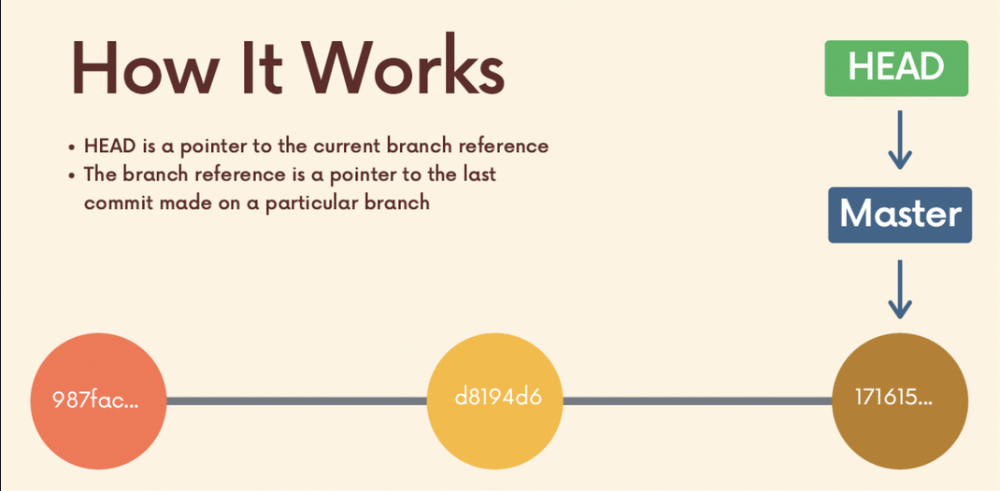
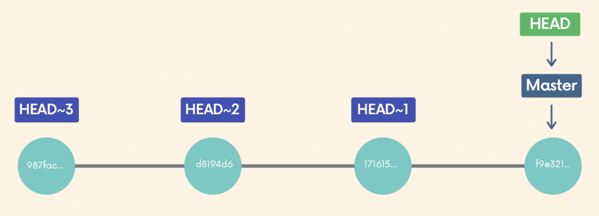

# Chap 10 | Undoing Changes & Travelling back in time 

Anki ➡️ 10-undoing-changes-and-travelling-back-in-time

#### Q1:What we can do in detached Head ? 

**Answer**:

- We can examine the contents of the old commit , poke around , view the files etc 

#### Q2:How to reattach detached HEAD ? 

**Answer**:

- Leave and switch back to wherever you were using `git switch -` or move to a particular branch using `git switch <branch_name>`
- Create a new branch and switch to it .You can now make and save changes since HEAD is no longer detached

#### Q3:How can we view a particular commit ? 

**Answer**:

- `git log --oneline` ➡️ Get the commit hash(First 7 digits)
- `git checkout <commit-hash>` (First 7 digits)

Note ➡️ We will be in detached HEAD in this state 

#### Q4:What is detached HEAD ? 

**Answer**:

- Usually HEAD points to a specific branch reference rather than a particular commit 
  - HEAD is a pointer to the current branch reference 
  - The branch reference is a pointer to the last commit made on a particular branch   

Detached HEAD ➡️ 

- When we checkout a particular commit , HEAD points at that commit rather than at the branch pointer 

  ```bash
  git checkout d8194d6
  ```

  


#### Q5:How to view the nth commit beyond HEAD ? 

**Answer**:

```bash
git checkout HEAD~n
```

Example ➡️ `git checkout HEAD~2`

Note ➡️ We will be in detached HEAD

- HEAD ~ 1 refers to the commit before HEAD (parent)
- HEAD ~ 2 refers to 2 commits before HEAD (grandparent)



#### Q6:Suppose you have made some changes to a file but dont want to keep them i.e to revert the file back to whatever it looked like when you last committed . What are the 2 ways of achieving it ? 

**Answer**:

- `git checkout HEAD <file>` for example `git checkout HEAD index.js`
- `git checkout -- <file>` for example  `git checkout -- index.js`

#### Q7:Suppose you have made some changes to a file since your last commit .You have saved the file but then realize you do not want those changes anymore 

#### 1. Restore the file (home.html) to the contents in the HEAD 

#### 2.Restore the contents of the file(home.html) to its state 2 commits prior to HEAD 

**Answer**:

1. `git restore home.html`
2. `git restore --source HEAD~2 home.html`

Note ➡️ `git restore <file-name>` restores using HEAD as the default source , but we can change that using the --source option .For example , `git restore HEAD ~ 2 home.html` : restores the contents of home.html to its state 2 commits prior to HEAD

#### Q8:You have accidentally added a file to your staging area and you dont wish to include it in the next commit , How to remove it from the staging area ? 

**Answer**:

- If you have accidentally added a file to your staging area with git add and you dont wish to include it in the next commit you can use git restore to remove it from staging
- Use the -- staged option : `git restore --staged app.js`

