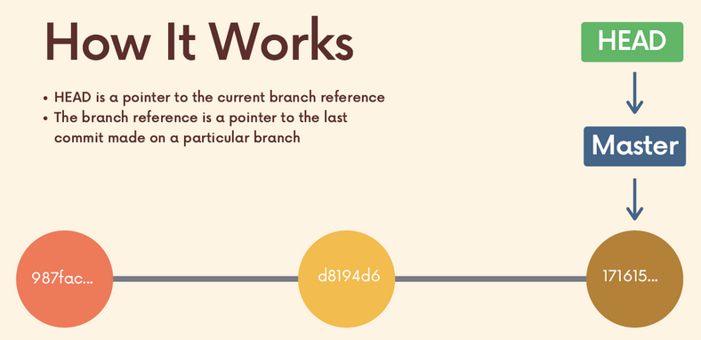
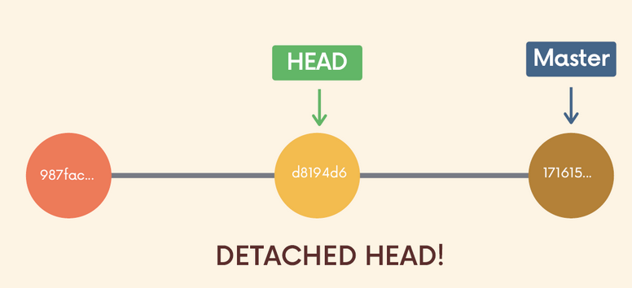
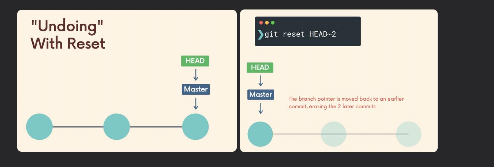
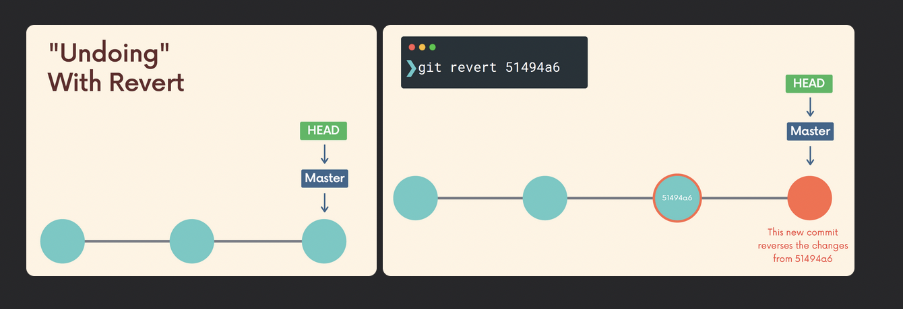

# Chap 10 | Undoing Changes & Travelling back in time

Anki ➡️ 10-undoing-changes-and-travelling-back-in-time

#### Q1:How can we view the contents of an old commit , poke around , view the files etc ? 

**Answer**:

- `git log --oneline`
- `git checkout commit-hash`

Note ➡️ This will put us in detached HEAD

#### Q2:What is detached HEAD ? 

**Answer**:

- HEAD is a pointer to the current branch reference 
- The branch reference is a pointer to the last commit made on a particular branch

- When we checkout a particular commit , HEAD points at that commit rather than at the branch pointer 

```bash
git checkout d8194d6	
```



#### Q3:How to reattach detached HEAD ? 

**Solution**:

- We can stay in detached HEAD to examine the contents of the old commit , poke around , view the files etc 
- Leave and switch back to wherever you were using `git switch -` or `git switch branch-name` - reattach the HEAD
- Create a new branch and switch to it . We can now make and save changes since HEAD is no longer detached

#### Q4:Suppose you have made some changes to a file since your last commit . You have saved the file and then realize you definately do not want those changes . How can we restore the file to the contents of the last commit ? 

**Solution**:

`git restore file`

Example : `git restore index.js`

Note ➡️  ⬇️

res**t**ore ➡️ the ultimate Control + Z

res**e**t ➡️ event horizon (going back in time)

re**v**ert ➡️ very good(as we should use git revert in place of git reset when sharing ) 

####  Q5:Suppose you have made a couple of commits on the master branch but you actually meant to make them on a seperate branch instead 

- How will you reset the repo back to a specific commit (only the commits are gone)
- You want to undo both the commits and the actual changes in your files 

**Solution**:

Reset the repo back to a specific commit (only the commits are gone) ➡️ ` git reset commit-hash`

Undo both the commits and the actual changes in your files ➡️ `git reset --hard commit-hash`

Note ➡️  ⬇️

res**t**ore ➡️ the ultimate Control + Z

res**e**t ➡️ event horizon (going back in time) 

re**v**ert ➡️ very good(as we should use git revert in place of git reset when sharing ) 

#### Q6:How to do git revert ? 

**Solution**:

- `git log --oneline`
- `git revert commit-hash`
- Fix the merges and then commit

Note ➡️  ⬇️

res**t**ore ➡️ the ultimate Control + Z

res**e**t ➡️ event horizon (going back in time)

re**v**ert ➡️ very good(as we should use git revert in place of git reset when sharing ) 

#### Q7:What is the difference between git revert and git reset ? 

**Solution**:

**Answer**:

- `git revert` is similar to `git reset` in that they both "undo" changes, but they accomplish it in different ways

  - `git reset` actually **moves the branch pointer backwards**, eliminating commits

  - `git revert` instead **creates a brand new commit** which reverses/undos the changes from a commit. Because it results in a new commit, you will be prompted to enter a commit message

  Note ➡️  ⬇️

  res**t**ore ➡️ the ultimate Control + Z

  res**e**t ➡️ event horizon (going back in time)

  re**v**ert ➡️ very good(as we should use git revert in place of git reset when sharing ) 

  

**Q8: Which one should i use between git reset and git reset  ?**

**Solution**: 

- Both `git reset` and `git revert` help us reverse changes, but there is a significant difference when it comes to **collaboration**
- If you want to reverse some commits that **other people already have on their machines**, you should use **revert**
- If you want to reverse commits that you **haven't shared with others**, use **reset** and no one will ever know

Note ➡️  ⬇️

res**t**ore ➡️ the ultimate Control + Z

res**e**t ➡️ event horizon (going back in time)

re**v**ert ➡️ very good(as we should use git revert in place of git reset when sharing ) 


#### Q9:You have accidentally added a file to your staging area with git add and you dont wish to include it in the last commit , How to remove it from staging ? 

**Solution**:

`git restore --staged app.js`

Note ➡️  ⬇️

res**t**ore ➡️ the ultimate Control + Z

res**e**t ➡️ event horizon (going back in time)

re**v**ert ➡️ very good(as we should use git revert in place of git reset when sharing ) 