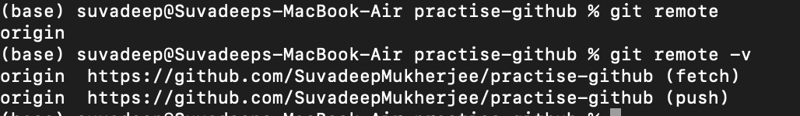

# Chap 11 | Github : The basics

Anki ➡️ 11-Github-The-basics

#### Q1:How to clone a public Github Repo ? 

**Answer**:

To clone a repo simply run `git clone <url>`

- Git will retreive all the files associated with the repository and will copy them to your local machine
- In addition ,Git initialises a new repository on your machine , giving you access to the full history of the cloned project ➡️make sure you are not in a repo when you clone
- Wherever you run git clone , that is the place where git is going to create a new folder for us

Note ➡️ `git clone <url>` will clone any hosted repo not just hosted on GitHub

#### Q2:What is a remote ? 

**Answer**:

- Before we can push anything up on Github , we need to tell Git about our remote repository on Github
- We need to setup a destination to push up to
- In Git we refer to these destinations as remote .Each remote is simply a URL where a hosted repository lives 

#### Q3:You already have an existing repo locally that you want to get on Github .What are the steps ?

**Answer**:

- Create a new repo on Github 
- Connect your local repo(add a remote)
  - `git remote add <name> <URL>`
- Push up your changes to Github

#### Q4:Create a github repo (you havent begun work on your local repo)

**Answer**:

- Create a brand new repo on Githhub
- Clone it on your machine (`git clone <URL>` , The local repo is automatically connected to Github)
- Do some work locally 
- Push up your changes to Github

#### Q5:How to view remotes ? 

**Answer**:

- To view any existing remotes for your repository we can run `git remote` or `git remote -v` (verbose , for more info)
- This just displays a list of remotes .If you havent added any remotes yet , you wont see anything 

#### Q6:How to add a new remote ? 

**Answer**:

- A remote is really 2 things : a URL and a label 
- To add a new remote , we need to provide both to Git
- `git remote add <name> <URL>`
- For example `git remote add origin https://github.com/SuvadeepMukherjee/Anki-Old-Decks`

#### Q7:What is origin ? 

**Answer**:

- This tells git, anytime I use the name "origin", I'm **referring** to this particular Github repo URL
- Origin is a **conventional Git remote name**, but it is not at all special. It's just a name for a URL
- When we clone a Github repo, the default remote name setup for us is called origin. You can change it. Most people leave it

#### Q8:What is the command to remove a remote ? 

**Answer**:

`git remote remove <name>`

#### Q9:What is the command to rename a remote ? 

**Answer**:

`git remote rename <old> <new>`

#### Q10:What does the following command do ? 

`git push origin master`

**Answer**:

It pushes the local master branch to a remote (by convention origin) master branch

Note ➡️ If the master branch does not exist on the remote (origin by convention) it will create it 

#### Q11:While we often want to push a local branch of the same name , we dont have to. 

We can use ______ to push a local branch up to a remote branch of different name 

**Answer**:

`git push <remote> <local-branch>:<remote-branch>` to push a local branch of different name 

For example `git push origin pancake:waffle` pushes our local pancake branch up to a remote branch called waffle

#### Q12:What does the word -u signify in the command `git push -u origin main`

**Answer**:

- The `-u` option allows us to set the **upstream** of the branch we're pushing

- We can think of this as a **link** connecting our local branch to a branch on Github

- `git push -u origin master` sets the upstream of the local master branch so that it **tracks the master branch on the origin repo**

- Once we've set the upstream of a branch, we can use `git push` shorthand which will push our current branch to the upstream

  ```bash
  # without upstream, every time git push origin master
  
  # with upstream, first time git push -u origin master 
  
  # next time git push
  ```

  

#### Q13:Whats the difference between main and master ? 

**Answer**:

1. [Why GitHub renamed its master branch to main](https://www.theserverside.com/feature/Why-GitHub-renamed-its-master-branch-to-main)
2. If you start your project from scratch by creating a repo on Github and clone it to your local machine, the default branch will be `main` and need no further changes
3. However, if you have your local repo with `master` as default branch, and want to change that branch name corresponds to Github's standard
   - Use `git branch -M main`

#### Q14:How to change name of branch from master to main ? 

**Answer**:

- Go to the master branch 
- then `git branch -M main`