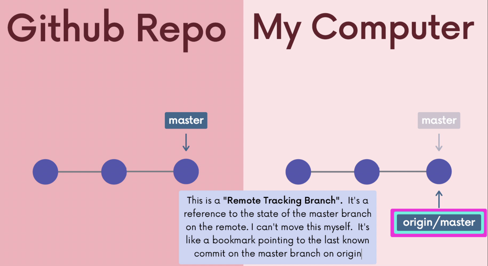
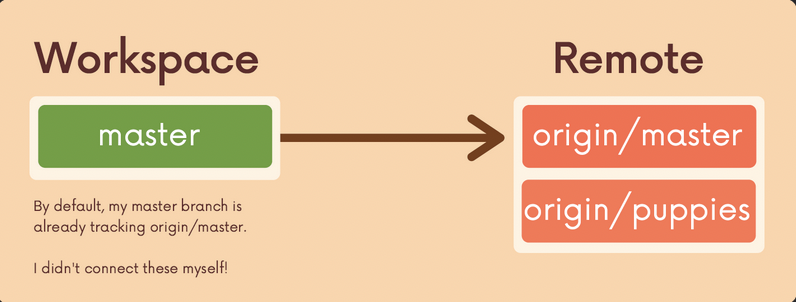
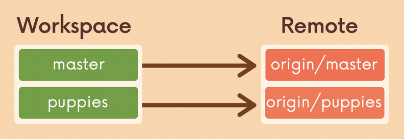
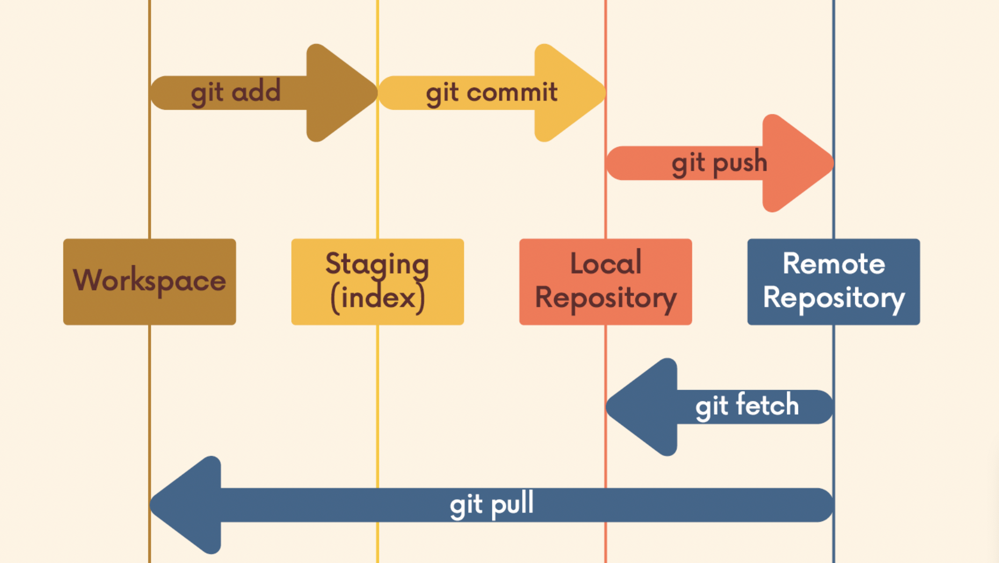

## Chap 12 | Fetching & Pulling

Anki ➡️ 12-fetching-and-pulling

#### Q1:What is a remote tracking branch ?

**Answer**:

When we clone a repo to our local machine from Github, we'll have two branch reference

- **Regular branch reference**: which we can move around

- **Remote Tracking Branch**: a reference to **the state of the master branch on the remote**. I can't move this myself
  
  - It's like a bookmark pointing to the last known commit on the master branch on origin

- At the time you last communicated with this remote repository, here is where x branch was pointing

- They follow this pattern `<remote>/<branch>`
  
  - `origin/master` references the state of the master branch on the remote repo named origin
  - `upstream/logoRedesign` references the state of the logoRedesign branch on the remote named upstream (a common remote name)

#### Q2:How to view the remote branches our local repository knows about ?

**Answer**:

`git branch -r`

#### Q3:How can we checkout on these remote branch pointers ?

**Answer**:

- We can checkout on these remote branch pointers using `git checkout origin/master`

Note ➡️ This will put us in detached HEAD

#### Q4:Once we have cloned a repository we have all the data and Git repository for the project at that moment in time .However that does not mean its all in my workspace

#### For example suppose we clone a Github repo that has a branch called puppies but when we run `git branch` we dont see it .All we see is the master branch

#### Whats going on ? and how can we get the puppies branch on our local branch and want it to be connected to origin/puppies

**Solution**:

- When we clone some repo from Github the local master branch automatically tracks origin/master however other branches are not being tracked 

- By default the master branch already tracks origin/master

- To have our own local branch called puppies and connected to origin/puppies just like my local master branch is connected to origin/master we have to run `git switch puppies`

Note ➡️ `git switch <remote-branch-name>` creates a local branch from the remote branch of the same name AND sets it up to track the remote branch origin/<remote-branch-name> 

#### Q5:What does fetching do ?

**Answer**:

- Fetching allows us to download changes from a remote repository BUT those changes will not be automatically integrated into our working place 
- It lets us see what others have been working on , without having to merge those changes into our local repo 
- Think of it as "Please go and get the latest information from Github but dont screw up my working directory"

#### Q6:Explain the following git commands

1. `git fetch <remote> <branch>`
2. `git fetch <remote>`
3. `git fetch`

**Solution**:

`git fetch <remote> <branch>` ➡️ 

- Fetch a specific branch from the remote 
- It only updates the remote tracking branch of that specific branch

`git fetch <remote>` ➡️ fetches branches and history from a specific remote repository .

Note ➡️It also updates remote tracking branches of that remote 

`git fetch` ➡️ Fetches branches and history from the default remote repository (origin)

Note ➡️ It also updates all the remote tracking branches  

#### Q7:What is the common use case of `git fetch` ?

**Solution**:

`git fetch` ➡️ update all the remote tracking branches 

#### Q8:What does the following command do ?

`git pull <remote> <branch>` 

**Solution**:

- git pull <remote> <branch> would fetch the latest information from the remote's (say origin) branch (say main) and merge those changes into our current branch 

Note ➡️ It matters WHERE  we run this command from .Whatever branch we run it from is where the changes will be merged into 

Note ➡️ Because of the merging , pulls can result in merge conflicts 🛑

#### Q9:What does git pull do ?

**Solution**:

If we run git pull without specifying a particular remote or branch , git assumes the following : 

- remote will default to origin

- branch will default to whatever tracking condition is configured for your current codition