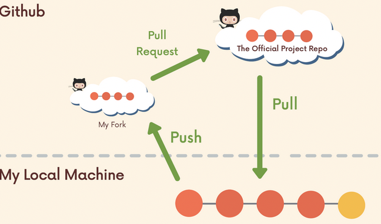

# Chap 14  | Git Collaboration Workflows

Anki ➡️ 14-git-colloboration-workflows

#### Q1:Do a demo of Feature branches PR with conflicts 

**Solution**:

**Setup**(Main Account)

- Create a repo from your main account (suvadeepm0709@gmail.com) and push a index.js file with the only code in the index.js file being `console.log("base")` to github 
- Add your alt account as collborator(*suvadeep-ship-it*), switch to the alt account and accept the invitation
- From the alt account in Github edit the single line to `console.log("alt change")`, commit directly to feature/demo branch
- Now from the main account , edit the same line , commit and push
- Now from the alt account raise a PR 
- From main account resolve the merge conflicts
  - Switch to feature/demo 
    - `git fetch origin` 
    - `git switch feature/demo`
    - `git merge main`
    - Fix merge conflicts
  - Switch to main . Merge in the feature/demo branch (now with no conflicts), push changes up to Github
    - git switch main
    - git merge feature/demo
    - git push origin main

#### Q2:Do a demo of Fork and clone workflow 

**Solution**:

- Create a repo on Github , put  something in it from your alt account 
- Fork the above repo to your original account 
- Clone the repo down to your local machine , the origin will be your own forked repo
- Add a remote pointing to the original repo i,e upstream pointing to the original repo 
  - Thus if there are changes(commits , PR merges ) made to the original repository we can pull those changes down 
  - `git remote add upstream <original-URL>`
- Now we have 2 remotes (origin and upstream)
- To get a better undertstanding do some commits on upstream and pull in to your local 

- Make changes and add/commit on a feature branch on your local machine
- Push up new feature branch to origin (your forked repo)
- Open a PR to the original Project repo containing the new work on your forked repo 
