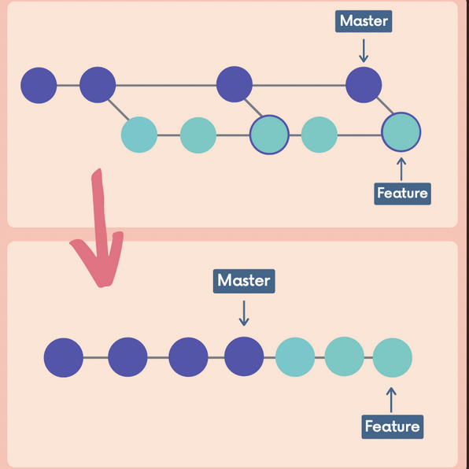
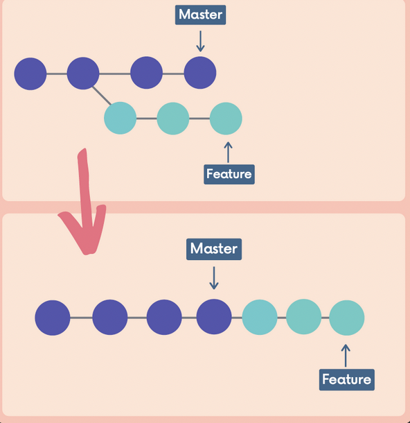
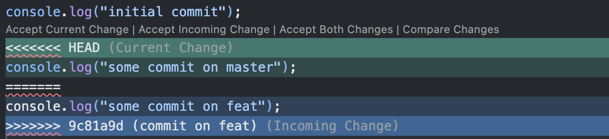

# Chap 15 | Rebasing

Anki ➡️ 15-rebasing

#### Q1:What is rebasing ? 

**Solution**:

- If the master branch is very active , my feature branches history is muddied because of a bunch of merge conflicts
- If we rebase the feature branch onto the master branch we actually rewrite history and end up with a linear structure 
- This moves the entire feature branch so that it begins at the tip of the master branch 
  - i.e re-base-ing them at the tip of the master
- Rebasing rewrites history by creating new commits for each of the original feature branches 
- We can also wait until we are done with a feature and then rebase the feature branch onto the master branch 

#### Q2:How to rebase ? (To get a better understanding do a demo of rebase)

**Solution**:

Command 

```bash
# make sure you are at your feat branch

git switch feat

git rebase master 
```

- We already have tons of merge from master into feature branch but we want to cleanup the structure 
- we just want to have new changes from master to our feature branch without previous merging
- new commits are made on the feature branch on top of the master branch's tip (the master branch is unaffected)

#### Q3:What is the golden rule of rebase ? 

**Solution**:

- **NEVER** rebase commits that have been **shared with others**
- If you have already pushed commits up to Github, DO NOT rebase them unless you are positive no one on the team is using those commits
- You do not want to rewrite any git history that other people already have. It's **a pain to reconcile the alternate histories**
  - Since you have commits that don't even exist in other's history, and they have commits that don't exist in yours (since you've rebased!)

#### Q4:How to handle conflicts during rebasing ? 

(To get a better understanding do a demo)

- Set up a test repository 
  - Create a folder called rebase-demo
  - Add a file called file.txt and add initial content on it 
  - commit it 
- Create a new feature branch 
  - git checkout -b "feature-branch"
  - echo "some feature content">>file.txt
  - git commit -am "Add feature content"
- Make more changes to the main branch
  - git switch master
  - echo "Another line in main">>file.txt
  - git commit -am "update in main" 

**Solution**:

- Resolve the conflict in your files

  - Note ➡️ Even though we have switched to feat the HEAD will point at master , it is one of the quirks of git 
  - Fix the conflicts

- git add conflicted-files to mark them as resolved 

- Now it will prompt to enter vscode/vim to enter a commit message 

  - Note ➡️When you do a **`git rebase --continue`**, Git needs to **finalize the commit** for the changes it just applied.(for the conflict commit)

    - During a rebase, Git is replaying commits from your branch on top of another branch (e.g., `master`).
    - If one of those commits causes a **conflict**, Git pauses and asks you to resolve it.
    - After you resolve the conflict and run `git add`, Git is ready to re-apply that commit.
    - But since the content has changed (because you had to resolve conflicts manually), Git gives you a chance to **edit the commit message** before finishing.

    👉 That Vim window shows the **commit message for the commit currently being applied** in the rebase.

    - Usually, it’s pre-filled with the original commit message.
    - You can **leave it as is**  if you don’t want to change the message.
    - Or you can edit it if you want a new commit message that better reflects the resolution.