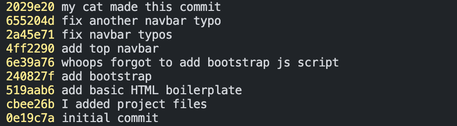
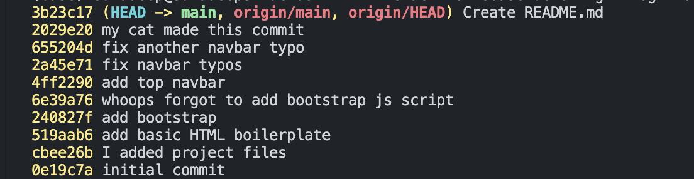
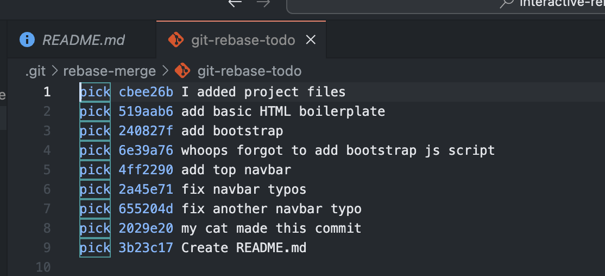
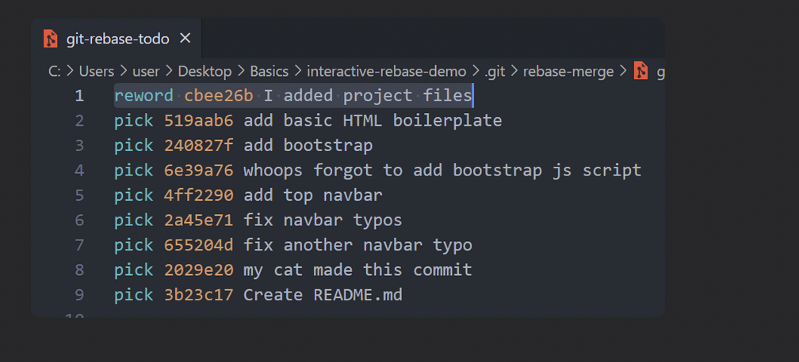
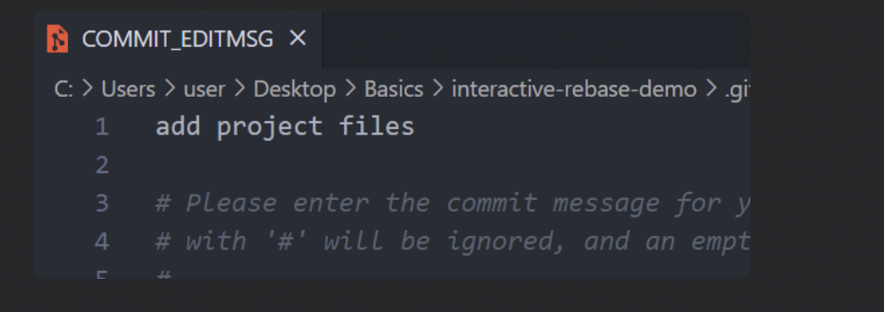
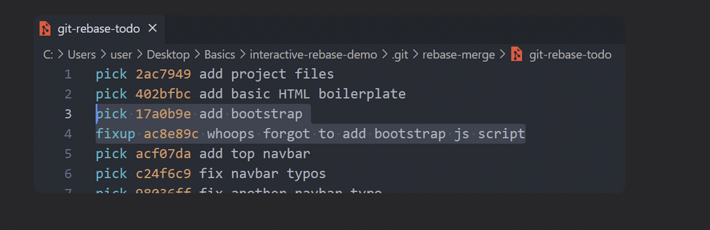
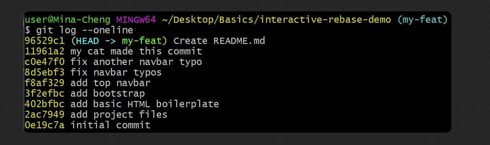
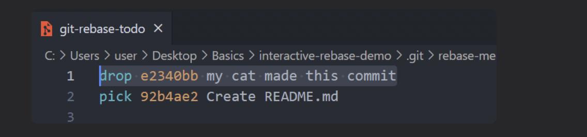
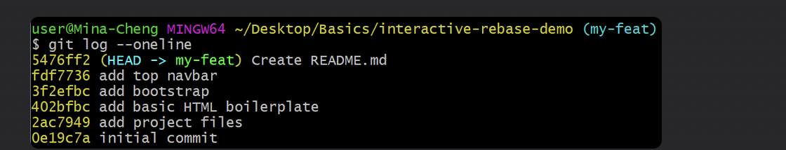

## Chap 16 | Cleaning up history with interactive rebase

#### Q1:What is the command which will lead us to the `git-rebase-todo` file which shows us a list of commands on the commits(all the way to HEAD~9)

**Solution**:

`git rebase -i HEAD~9`

#### Q2:In the git-rebase-todo file we can use the commands to modify our commits 

pick ➡️ use the commit

reword ➡️ use the commit but edit the commit message 

fixup ➡️ use commit contents but meld it into previous commit and discard the commit message 

drop ➡️ remove commit

#### Q3: [Exercise](https://github.com/Colt/interactive-rebase-demo) to follow along

####  

- For the commit "i added project files" use the commit but change the message to "add project files"
- Meld the commit "whoops forgot to add bootstrap js script" to its previous commit (add bootstrap) with only the previous commit message being kept
- drop the commit "my cat made this commit"

Preliminary Steps :

- Create and switch to a new branch `my-feat` first, you don't want to rebase on master branch and mess it up

**Solution**:

- If we use `git rebase -i HEAD~9`, it will lead us to a `git-rebase-todo` file, which shows us a list of **commands** on the commits (all the way to `HEAD~9`)

## Reword Commits

- `git rebase -i HEAD~9`
- Change the `git-rebase-todo` file's first line to `reword ....` and save

- Another file will open up, change the commit message and save

## Fixup & Squash Commits

- Change the `git-rebase-todo` file's 4th line to `fixup ....` and save
  - This will **meld** that commit (whoops…) to its **previous** commit (add bootstrap) with only the previous commit's message being kept

- See our git log, we're done with different commit hash!

## Drop Commits

- Change the `git-rebase-todo` file's first line to `drop ....` and save

- Save and done