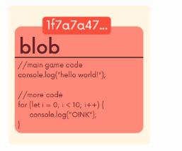
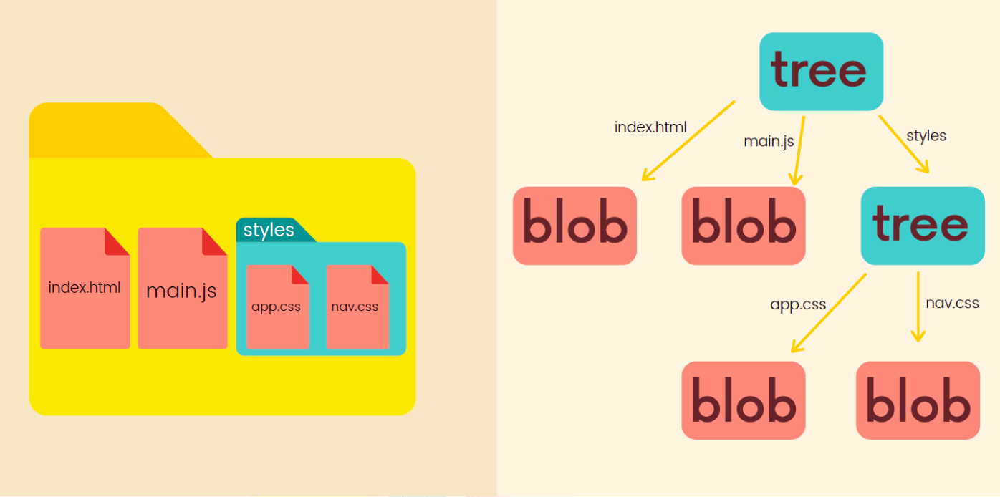
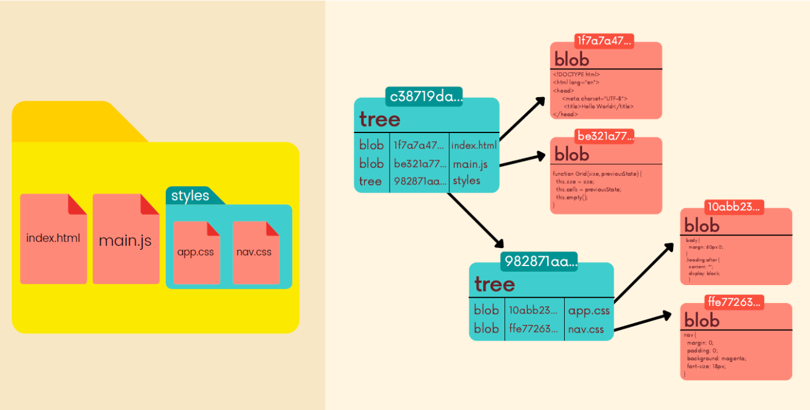
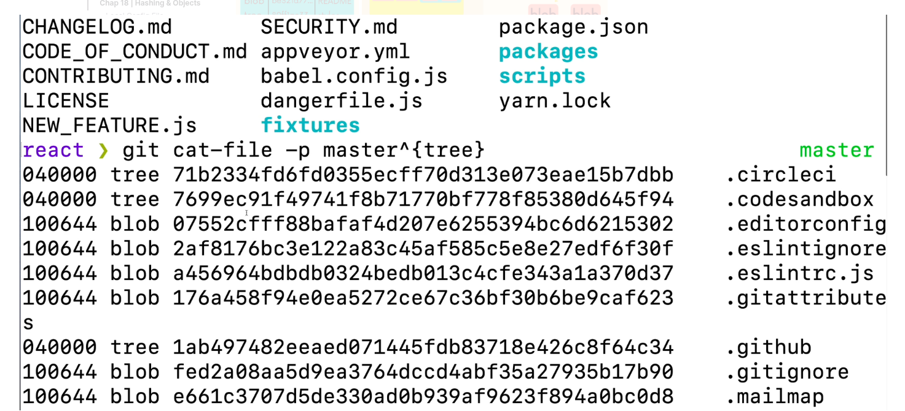
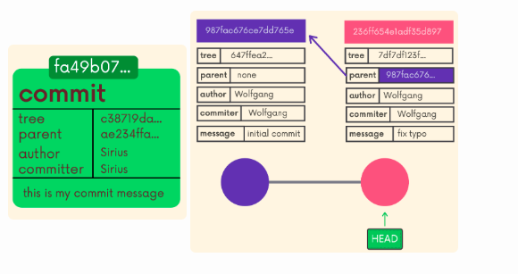

# Chap 18 | Hashing & Objects

Anki ➡️ 18-hashing-and-objects

#### Q1:What is in the .git file ?

**Solution**:

- objects
- config
- HEAD
- refs
- and much more

#### Q2:What is the config file for ?

**Solution**:

- The config file is for configuration

#### Q3:How to configure name and email per-repo basis ?

**Solution**:

To configure name and email per-repo basis 

- `git config --local user.name "suvadeep"`
- `git config --local user.email "suvadeepm0709@gmail.com`"

#### Q4:What is the Refs Folder for ?

**Solution**:

- Refs stands for references , is where Git stores all of the pointers that points to certain commits (eg branch pointers , tags,remotes)

Note ➡️ 

- Inside of `refs`, you'll find a **heads directory**
- `refs/heads` contains **one file per branch** in a repository. Each file is named after a branch and contains the hash of the commit at the tip of the branch
  - For example `refs/heads/master` contains the commit hash of the last commit on the `master` branch
- `Refs` also contains a `refs/tags` folder which contains one file for each tag in the repo
- Refs also contains a refs/remotes folder

#### Q5: What does the HEAD File contain ?

**Solution**:

- `HEAD` is just a text file that keeps track of **where HEAD points to**
- If it contains `refs/heads/master`, this means that HEAD is pointing to the master branch
- In detached HEAD, the `HEAD` file contains a commit hash instead of a branch reference

#### Q6:What does the Objects Folder contain ?

**Solution**;

- The objects directory contains **all the repo files**. This is where Git stores the **backups** of files, the commits in a repo, and more
  - The files are all compressed and encrypted into binary files
  - Git stores **full** snapshots, not just diffs

#### Q7:What are the Four types of Git objects ?

**Solution**:

The Four types of Git objects are 

- commit 
- tree
- blob
- annotated tag

#### Q8:What is a Hashing Function ?

**Solution**:

- Hashing functions are functions that map input data of some arbitrary size to fixed-size output values

**Cryptographic hash functions**

- A subset of hash functions

- **One-way** function which is infeasible to invert

- Small change in input yields large change in the output

- Deterministic: same input yields same output

- Unlikely to find 2 outputs with same value (avoid collision)

- Applications: information security, digital signatures, cryptocurrency, and Git
  
  SHA-1

- Git uses a hashing function called SHA-1

- SHA-1 always generates 40-digit hexadecimal numbers

- The commit hashes we've seen a million times are the output of SHA-1

#### Q9:Git is a ______ Datastore

**Solution**:

Git is a key-value data store. We can insert any kind of content into a Git repository, and Git will hand us back a unique key we can later use to retrieve that content

- These keys that we get back are SHA-1 checksums

#### Q10:What are blobs ?

**Solution**:

- Git blobs (binary large object) are the object type Git uses to store the contents of files in a given repository

- Blobs dont even include the filenames of each file or any other data .They just store the contents of a file

- 

#### Q11:What are trees ?

**Solution**:

- Trees are Git objects used to store the **contents of a directory**

- Each tree contains **pointers** that can refer to blobs and to other trees (for nested directories)
  
  - Each entry in a tree contains the SHA-1 **hash** of a blob or tree, as well as the mode, type, and **filename**

- We can use `git cat-file -p master^{tree}` to print out the tree object that is pointed to by the tip of our master branch

#### Q12:What are commit objects ?

**Solution**:

- Commit objects combine a **tree object** along with information about the context that led to the current tree, such as a reference to parent commit(s), the author, the commiter, and of course the commit message

- When we run `git commit`, Git creates a new commit object whose parent is the current HEAD commit and whose tree is the current content of the index (staging area)