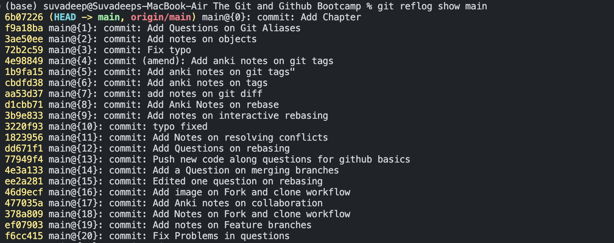

## Reflogs - Retreiving Lost Work

Anki ➡️ 19-reflogs

#### Q1:What is reflogs ? 

**Solution**:

- short for reference logs
- Git keeps a record of when the tips of branches and other references were updated in the repo

#### Q2:What are the limitations of reflogs ? 

**Solution**:

- Git only keeps reflogs on your local activity (They are not shared with collaborators)
- Reflogs also expire .Git cleans out old entries after around 90 days though this can be configured

#### Q3:Explain the git reflog command 

**Solution**:

- The **git reflog** command aceepts subcommands show , expire , delete and exists .show is the only commonly used variant and it is the default subcommand 
- **git reflog show <references>** will show the log of a specific reference(it defaults to HEAD)
  - `git reflog show HEAD`
  - `git reflog show main`  ➡️ view the logs for the tip of the main barnch 

Note ➡️ We have the <reference>{qualifier} tags which indicate a particular entry in the reflog

 

  