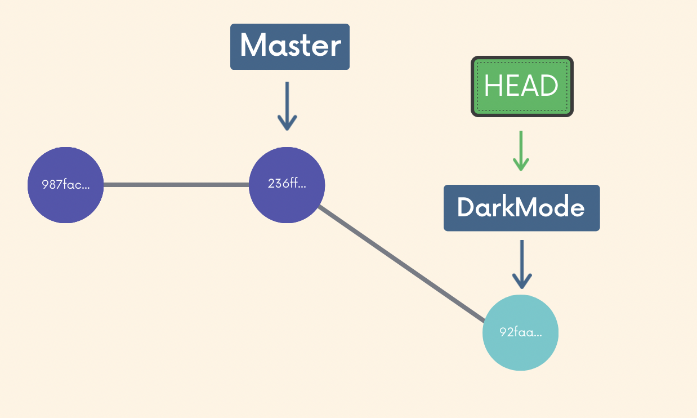

## Anki Notes 

Chap 6 | Working with branches (Anki Tag: 06-working-with-branches)

#### Q1:What is the master branch ? 

**Answer**:The default branch name is master , According to official convention GitHub has renamed the name master while git has changed the name to main from master 

#### Q2:What is a branch ? 

**Answer**:

- Each branch has a branch reference pointing to where we left called branch pointer . A branch pointer is where a branch currently is . Head is a reference to a branch pointer 
- HEAD is simply a **pointer** that refers to the **current "location"** in your repository. It points to a particular branch reference
- Like many different bookmarks in a book, only one position can be opened at a time

#### Q3:What is the git command to view existing branches ?

**Answer**:

`git branch`

Look for the * which indicates the branch we are currently on 

#### Q4:If git branch shows us in full screen all the branches then what is the command to exit  ? 

**Answer**:

Press `q` to exit

#### Q5:What is the 3 ways  to make a new branch based upon the current HEAD and switch to it ?

**Answer**:

- Use `git branch <branch-name>` to make a new branch based upon the current HEAD .This just creates the branch , it does not switch you to that branch (the HEAD stays the same). Once you have created a new branch, use `git switch <branch-name>` to switch to it
- Another way of switch: `git checkout <branch-name>`, but this command does a million additional things
- Create and switch to a branch **at the same time**: `git switch -c <branch-name>` or `git checkout -b <branch-name>`
  - `-c` stands for create
  - `-b` stands for branch

#### Q6:If you switch branches with unstaged changes when we will get an error and what are the ways to fix the error also when we will not get error ? 

**Answer**:

- If you switch branches with unstaged changes we will get an error if the unstaged changes are not a new file 

- Two options:

  - commit it 
  - stash it 

  We will not get an error if the unstaged changes are not in a new file and the new file will be moved to the new branch 

#### Q7:What is the command to delete a branch ? 

**Answer:**

Use `git branch -d <branch-name>`

- You cannot be in that branch if you want to delete it
- You cannot delete a branch thats not fully merged , we can confirm we want to delete it with the D flag i,e `git branch -D <branch-name>`

#### Q8:What is the command to rename a branch ? 

**Answer**:

Use `git branch -m <new-branch-name>` to rename a branch, when **you are in the branch** you want to rename

