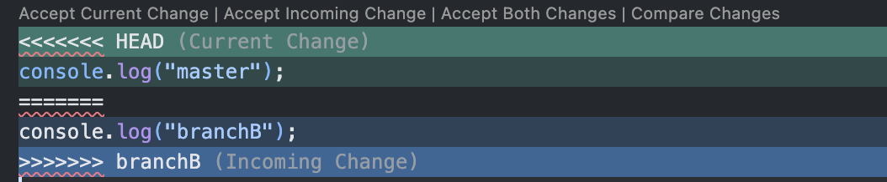

# Chap 7 | Merging Branches

Anki Tag : 07-merging-branches 

#### Q1:How to merge 2 branches ? 

**Answer**:

- Switch to or checkout the branch we want to merge the changes into (the receiving branch)
- Use `git merge` to merge changes from a specific branch into our current branch 

#### Q2:What is Fast Forward Merge ? 

**Answer**:

-  A Fast-Forward merge occur when there is a linear path from the current branch tip to the target branch , instead of actually merging the branches , all git has to do to integrate the histories is move (i,e fast forward) the current tip up to the target branch tip 

  ```bash
  #For example , merge the bugfix branch into master
  
   git switch master
  
  git merge bugfix 
  ```

#### Q3:What are the various types of Merges ? 

**Answer**:

- Fast Forward Merge
- Merge with no conflicts
- Merge with conflicts 

#### Q4:Explain the complete steps of Merge with no conflicts 

**Answer**:

- BranchA and branchB 
- We switch to branchA and want to merge branchB
- `git merge branchB`
- We enter vim , we enter our custom commit message 
- Git will Auto merge with the commit message 

#### Q5:Explain the complete steps of Merge with conflicts 

**Answer**:

-  2 branches master and branchB
- want to merge branchB into master
- When we encounter a merge conflict ,Git warns us in the console that it could not automatically merge 
- It also changes the contents of our file to indicate the conflicts that it wants us to resolve 
  - The contents from our current HEAD (the current branch we are trying to merge content into is displayed between the <<<<< HEAD and =======)
  - The content from the branch we are trying to merge is displayed between the ===== and >>>>>>> symbols 

Resolving Conflicts 

- open up the file(s) with merge conflicts 
- Edit the file(s) to remove duplicates .Decide which branch's content we want to keep in each conflict or keep the content from both 
- Remove the conflict markers in the document 
- Add your changes and then make a commit