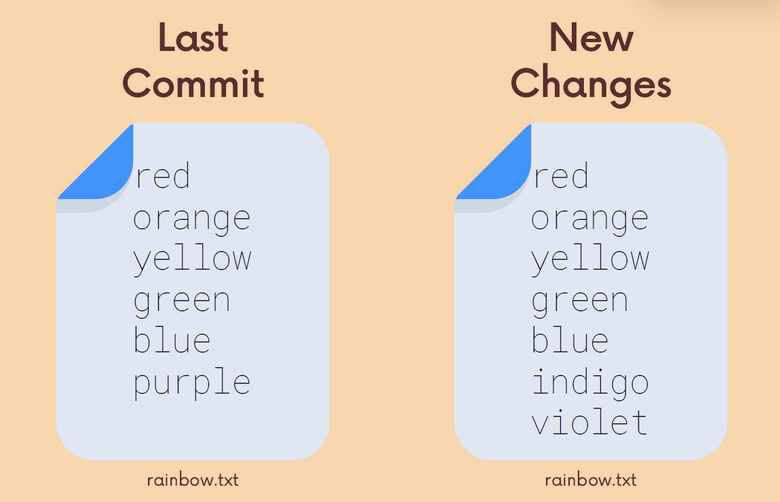
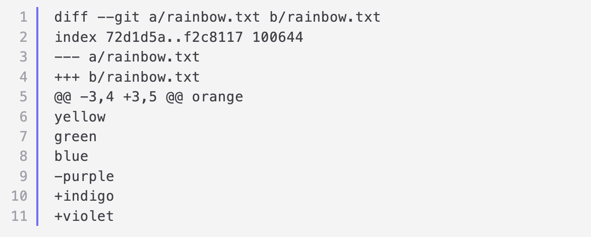

## Chap 8 | Comparing Changes with git diff 

Anki ➡️ 08-comparing-changes-with-git-diff

#### Q1:Why we use git diff ? 

**Solution**:

- We use git diff to view changes between commits , branches , files our working directory and more

#### Q2: Read the diff 

**Solution**:

**Line 1**: Which files are being compared, usually is the two versions of the same file. One is declared as "A", and the other as "B"

**Line 2**: File metadata

**Line 3-4**: Markers, file A and B are each assigned a symbol

- File A gets a minus sign (-)
- File B gets a plus sign (+)

**Line 5-11**: Chuncks, shows portions or  "chunks" that were modified, also includes some unchanged lines before  and after a change to provide some context

- Chunk header: @@ -3,4 +3,5 @@
  - From file A, 4 lines are extracted starting from line 3
  - From file B, 5 lines are extracted starting from line 3
- Changes: Every line that changed between the two files is marked with either a + or - symbol
  - Lines that begin with - come from file A
  - Lines that begin with + come from file B

#### Q3:Write the following git commands 

1. Git command to compare files in staging area and working directory 
2. List all changes in the working directory since your last commit (include all staged and unstaged changes)
3. changes between staging area and our last commit 

**Solution**:

1 ➡️ `git diff` (Lists all changes between staging area and working directory)

2 ➡️ `git diff HEAD` (Lists all changes in the working directory since your last commit )

3 ➡️ `git diff --staged` (Changes between staging area and our last commit)

#### Q4:Comapare changes between branch1 and branch2 

**Solution**:

`git diff branch1 .. branch2`

will list the changes between the tips of branch1 and branch2 

order does matter : branch1 will  be fileA and branch2 will be fileB 

#### Q5:Compare changes between 2 commits 

**Solution**:

`git diff commit1 commit2`

will list  the changes between the 2 commits , Provide git diff with the commit hashes of the 2 commits (First 7 digits)

order does matter : commit1 will be fileA and commit2 will be fileB  