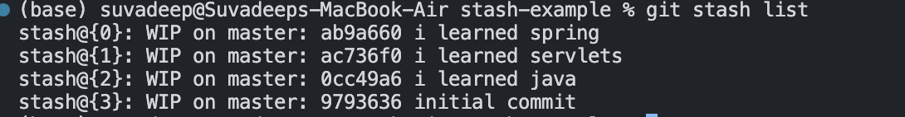

# Chap 9 | The Ins and Outs of Stashing

Anki ➡️ 09-the-ins-and-outs-of-stashing

#### Q1: Why do we need stashing ?

**Answer**:

Imagine when you switch to other branches with uncommitted files on current branch , what will happen ?

- My changes come with me to the destination branch (no potiential conflicts)
- Git wont let me switch if it detects potiential conflicts

Stashing ➡️➡️ Git provides an easy way of stashing these uncommitted changes so that we can return to them later 🔥 without having to make unnecessary commits

#### Q2:git stash / git stash pop

**Answer**:

- _git stash_ will take all uncommitted changes (staged and unstaged) and stash them , reverting the changes in our working directory
- _git stash pop_ removes the most recently stashed changes in your stash and re-apply them in your working directory

#### Q3:git stash apply

**Answer**:

- We can use git stash apply to apply whatever is stashed away without removing it from the stash
- This can be useful if we want to apply stashed changes to multiple branches

#### Q4:How can we view stashes ?

**Answer**:

- We can add multiple stashes onto the stack of stashes .They will all be stashed in the order you added them ➡️ stack!
- Viewing stashes ➡️ use `git stash list`

Note ➡️ WIP(work in progress) on <branch> : <most-recent-commit-hash> <most recent commit message>

#### Q5:How to apply a specific stash ? 

**Answer**:

- git assumes we want to apply the most recent stash when we run `git stash apply` but we can also specify a particular stash like `git stash apply stash@{2}`

#### Q6:How to clear the stash ? 

**Answer**:

git stash clear 

#### Q7:How to drop a particular stash ? 

**Answer**:

Example ➡️ `git stash drop "stash@{2}"`
