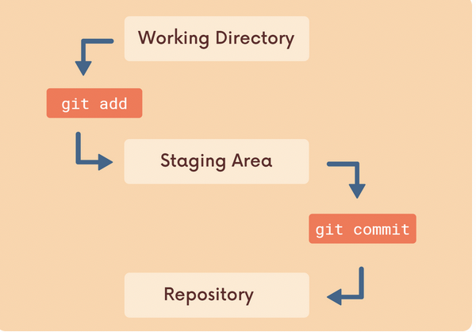

## Anki Notes 

#### Chap 3 | Installation & Setup (Anki Tag : 03-installation-and-setup)

**Q1**: Git command to set name and email ? 

**Answer**:

```bash
git config --global user.name "suvadeep"

git config --global user.email "suvadeepm0709@gmail.com"


```

**Q2**: Git command to check current  name and email ? 

**Answer**:

```bash
git config user.name

git config user.email
```

#### **Q3**: Terminal  commands  for the following 

1. list the contents of current working directory/ specified working directory
2. Open the current working directory , open a specified folder 
3. print working directory 
4. change directory 
5. move back one folder 
6. create a file called app.js
7. create a directory 
8. delete a file called hello.txt
9. delete a folder called LandTurtles 

**Answer**:

1. ls => list the contents of current working directory , ls folder => list the contents of a specified folder 
2. open . => open the current folder , `open <directory>` => open a specified folder 
3. pwd => print working directory 
4. `cd <dir>` => change directory to dir 
5. cd .. => move back one directory 
6. touch app.js
7. mkdir dir
8. `rm hello.txt`
9. `rm -rf LandTurtles`

------

### Chap 4 | The Very Basics of Git : Adding & Committing (anki tag : 04-adding-and-committing)

**Q1**: What is a git repo ? 

**Answer**:

- A git repo is a workspace which tracks and manages files within a folder
- We can have  as many repos on our machine as needed , all with seperate histories and contents 


**Q2**: How to check the status of a git repo ? 

**Answer**:

`git status` : gives information on the current status of a git repository and its contents 

**Q3**: How to initialize a new git repo ? 

**Answer**:

- `git init` ➡️ creates a new git repository 
- Do once per project , initialise the repo in the top-level folder containing our project 
- will create a hidden `.git` folder for us 

**Q4**: We have created a new git repo inside a git repo , how to fix it ? 

**Answer**:

- check all files with `ls -a` then delete the nested `.git` folder with `rm -rf`

**Q4**: What is Working Directory , Staging area and Repository ? 

**Answer**:

Working Directory ➡️ When we edit some files and check git status that is @ working directory 

Staging Area ➡️ We add files from the working directory to the staging area with `git add`

Repository ➡️ We move files from the the staging area to the Repository with `git commit`

 

**Q5**: How to add all files and individual files from Working directory to staging area ? 

**Answer**:

add all files from working directory to staging area ➡️ `git add .`

add individual files from working directory to staging area with ➡️ `git add file1 file2`

**Q6**: How to see logs of all commits ? 

**Answer**:

To see logs of all commits use ➡️ `git log`

