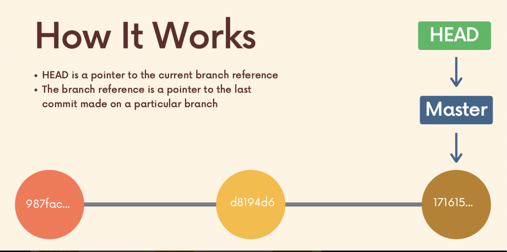
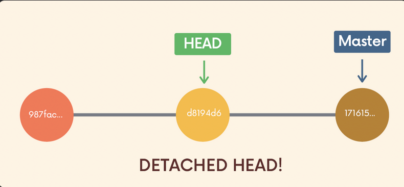
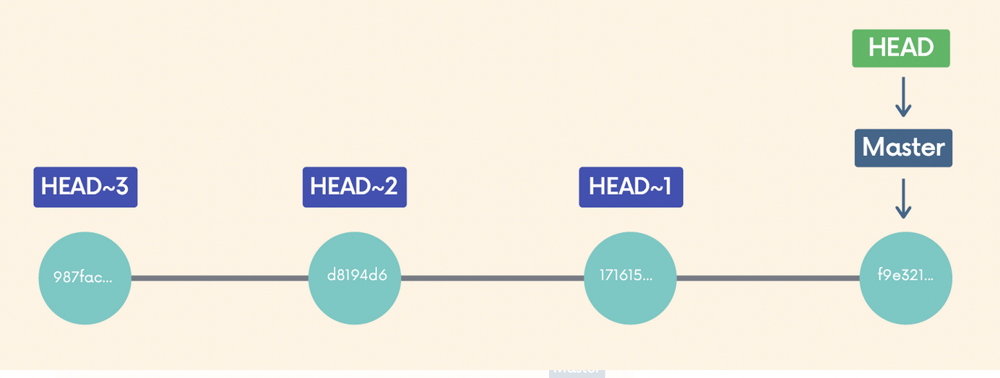
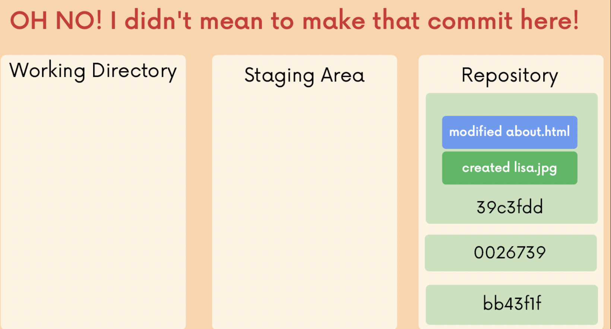
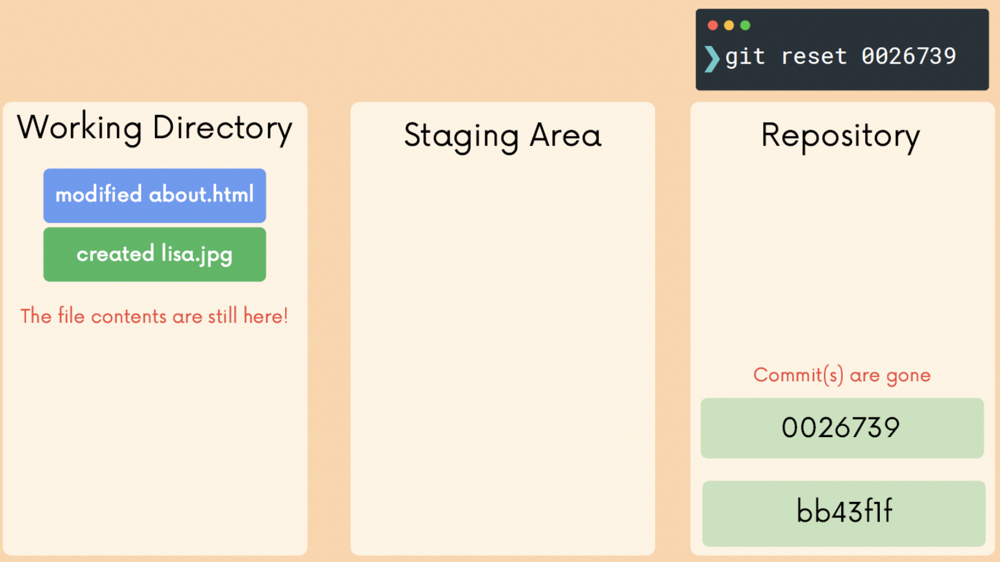
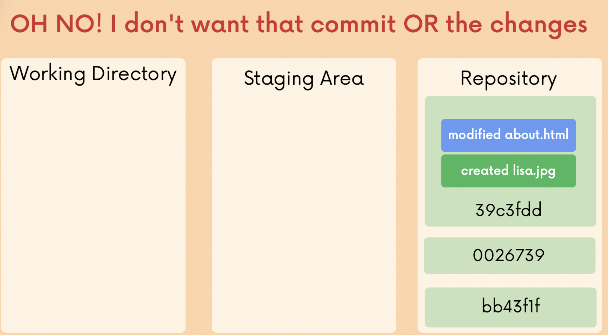
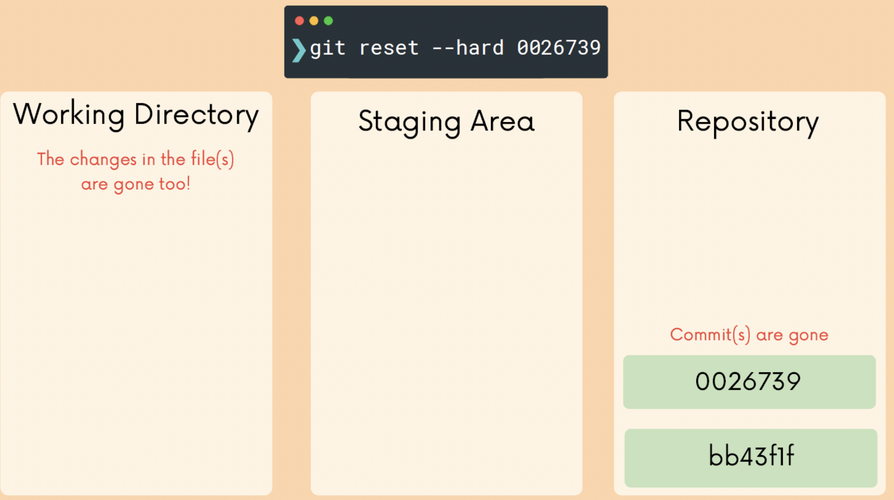

# Chap 10 | Undoing Changes & Travelling back in time 

## Checking Out Old Commits 

- The `git checkout` command is like a Git Swiss Army knife. Many developers think it is overloaded, which is what lead to the addition of the `git switch` and `git restore` commands
- We can use `git checkout` to create branches, switch to new branches, restore files, and undo history
- `git checkout <commit-hash>` to view a previous commit
- You'll see the following message, **Detached HEAD** state:

- Usually, **HEAD** points to a specific **branch reference** rather than a particular commit
  - **HEAD** is a pointer to the **current branch reference**
  - The **branch reference** is a pointer to the **last commit** made on a particular branch

- So what is **detached head**?

  - When we checkout a particular commit, **HEAD points at that commit** rather than at the branch pointer

    ```bash
    git checkout d8194d6
    ```



## Re-Attaching Detached HEAD

- What to do when having a detached head?
  - Stay in detached HEAD to **examine the contents** of the old commit. Poke around, view the files, etc
  - Leave and switch back to wherever you were before using `git switch <branch-name>` or `git switch -` - **reattach the HEAD**
  - **Create a new branch** and switch to it. You can now make and save changes, since HEAD is no longer detached

## Referencing Commits Relative to HEAD 

- git checkout supports a slightly odd syntax for referencing previous commits relative to a particular commit 
  - HEAD ~ 1 refers to the commit before HEAD (parent)
  - HEAD ~ 2 refers to 2 commits before HEAD (grandparent)



## Discarding Changes with git checkout

- Suppose you have made some changes to a file but dont want to keep them i.e to revert the file back to whatever it looked like when you last committed 
- Use `git checkout HEAD <file>` to discard any changes in that file , reverting back to the HEAD 
- Another option : `git checkout -- <file>`
- Examples ➡️ 
  - `git checkout HEAD index.js`
  - `git checkout -- index.js`

Note ➡️ That is suppose you have made some changes since the last commit but you dont want to save those changes , you can delete them manually (which may be scattered and time- consuming) or you can use `git checkout HEAD <file>` to restore the file to the state of the last commit

## Unmodifying with Git restore 

- git checkout does a million different things , which many git users find very confusing . git restore was introduced alongside git switch as alternatives to some of the uses for checkout 
- git restore is a brand new git comment that helps with undoing operations 
- Suppose you have made some changes to a file since your last commit .You have saved the file but then realise you definately do not want those changes 
  - To restore the file to the contents in the HEAD use `git restore <file-name>`
  - same as `git checkout HEAD <file-name>`

Select your source instead of HEAD 

-  `git restore <file-name>`restores using HEAD as the default source but we can change that using the --source option
- For example `git restore -- source HEAD ~ 1 home.html` restores the contents of home.html to its state from the commit prior to HEAD 

## Un-Staging Changes with Git restore 

- If you have accidentally added a file to your staging area with git add and you dont wish to include it in the next commit you can use git restore to remove it from staging
- Use the -- staged option : `git restore --staged app.js`

## Undoing Changes with Git reset 

- Suppose you've just made a couple of commits on the master branch, but you actually meant to make them on a separate branch instead

- To **undo those commits**, you can use `git reset <commit-hash>`, which will reset the repo back to a specific commit, **the commits are gone**
- Git will go back to the specified commit and delete the commits after that commit , but that changes you made in that commit will still remain 

​		

 

- If you want to undo both the commits and the actual changes in your files , you can use the --hard option :`git reset --hard commit-hash`



