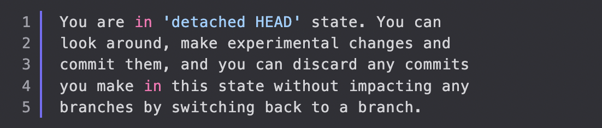

# Chap 10 | Undoing Changes & Travelling back in time 

## Checking Out Old Commits 

- The `git checkout` command is like a Git Swiss Army knife. Many developers think it is overloaded, which is what lead to the addition of the `git switch` and `git restore` commands
- We can use `git checkout` to create branches, switch to new branches, restore files, and undo history
- `git checkout <commit-hash>` to view a previous commit
- You'll see the following message, **Detached HEAD** state:

- Usually, **HEAD** points to a specific **branch reference** rather than a particular commit
  - **HEAD** is a pointer to the **current branch reference**
  - The **branch reference** is a pointer to the **last commit** made on a particular branch

- So what is **detached head**?

  - When we checkout a particular commit, **HEAD points at that commit** rather than at the branch pointer

    ```bash
    git checkout d8194d6
    ```


## Re-Attaching Detached HEAD

- What to do when having a detached head?
  - Stay in detached HEAD to **examine the contents** of the old commit. Poke around, view the files, etc
  - Leave and switch back to wherever you were before using `git switch <branch-name>` or `git switch -` - **reattach the HEAD**
  - **Create a new branch** and switch to it. You can now make and save changes, since HEAD is no longer detached