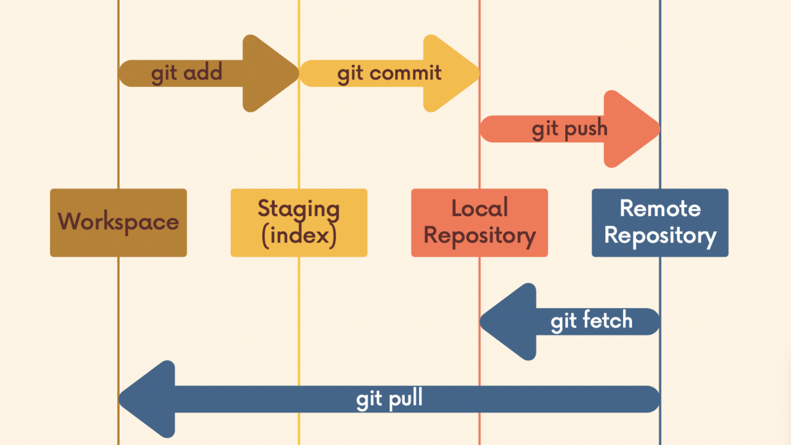

## Chap 12 | Fetching & Pulling

## Remote Tracking Branch

- When we clone a repo to our local machine from Github, we'll have two branch reference
  
  - **Regular branch reference**: which we can move around
  
  - **Remote Tracking Branch**: a reference to **the state of the master branch on the remote**. I can't move this myself
    
    - It's like a bookmark pointing to the last known commit on the master branch on origin
  
  - At the time you last communicated with this remote repository, here is where x branch was pointing
  
  - They follow this pattern `<remote>/<branch>`
    
    - `origin/master` references the state of the master branch on the remote repo named origin
    - `upstream/logoRedesign` references the state of the logoRedesign branch on the remote named upstream (a common remote name)
  
  - Run `git branch -r` to view the remote branches our local repository knows about
  
  - We can checkout these remote branch pointers using `git checkout origin/master`
    
    - To know what did this project look like when you first cloned this repo
    - This will put us in Detached HEAD

## Working with Remote Branch

- Once You've cloned a repository , we have all the data and Git history for the project at that moment in time .However , that does not mean it's all in my workspace 

- The github repo has a branch called puppies, but when I run `git branch` I don't see it on my machine! All I see is the master branch. What's going on?
  
  - Run `git branch -r` to view the remote branches our local repository **knows about**

- When we clone some repo from Github, the local master branch is **automatically tracking** `origin/master`; however, other branches are not being tracked

- We can use `git checkout origin/puppies`, but that results in detached HEAD state

- Thus, I want my own **local branch** called puppies, and I want it to **be connected to `origin/puppies`**, just like my local master branch is connected to `origin/master`

- We can run `git switch <remote-branch-name>` to **create a new local branch** from the remote branch of the same name AND sets it up to **track the remote branch** `origin/<remote-branch-name>`

## Git Fetch

- When you collaborate with others on the same project, and someone push to the Github repo while **your local repo don't know that change**, what could you do?

- **Fetching** allows us to download changes from a remote repository, BUT those changes will **not be automatically integrated** into our working files
  
  - It lets you see what others have been working on, without having to merge those changes into your local repo
  - Think of it as "please go and get the latest information from Github, but don't screw up my working directory

- Git Fetch commands
  
  - git fetch <remote>: fetches branches and history from a specific remote repository. It also updates remote tracking branches
    
    - e.g., `git fetch origin`
    
    - If not specified, `<remote>` defaults to `origin`
  
  - `git fetch <remote> <branch>`: fetch a specific branch from a remote
    
    - e.g., `git fetch origin master`
  
  - I now have those changes on my machine, but if I want to see them I have to **checkout** origin/master. **My master branch is untouched**
  
  - Using `git fetch <remote>` **gets the latest information about some remote repo**, but won't integrate those changes to your working directory

## Git Pull

- `git pull` is another command we can use to retrieve changes from a remote repository

- Unlike `git fetch`, `git pull` actually **updates our HEAD branch** with whatever changes are retrieved from the remote
  
  - "go and download data from Github AND immediately update my local repo with those changes"
  
  

- To pull, we specify the particular remote and branch we want to pull using `git pull <remote> <branch>`
  
  - Just like with `git merge`, it matters WHERE we run this command from
  - Whatever branch we run it from is where the changes will be merged into
  - e.g., `git pull origin master` would fetch the latest information from the origin's `master` branch and merge those changes into our current branch

- Because of the merging, pulls can result in merge conflicts

## Easier Syntax for Git Pull

1. If we run `git pull` without specifying a particular remote or branch to pull from, git assumes the following:
   - remote will default to `origin`
   - branch will default to whatever **tracking connection** is configured for your **current branch**

## Fetch vs. Pull in Summary

1. `git fetch <remote>` or `git fetch <remote> <branch>`
   - Gets changes from remote branch(es)
   - Updates the **remote-tracking branches** with the new changes
   - Does not merge changes onto your current HEAD branch
   - Safe to do at anytime
2. `git pull <remote> <branch>` or `git pull`
   - Gets changes from remote branch(es)
   - Updates the **current branch** with the new changes, **merging** them in
   - Can result in merge **conflicts**
   - Not recommended if you have uncommitted changes!