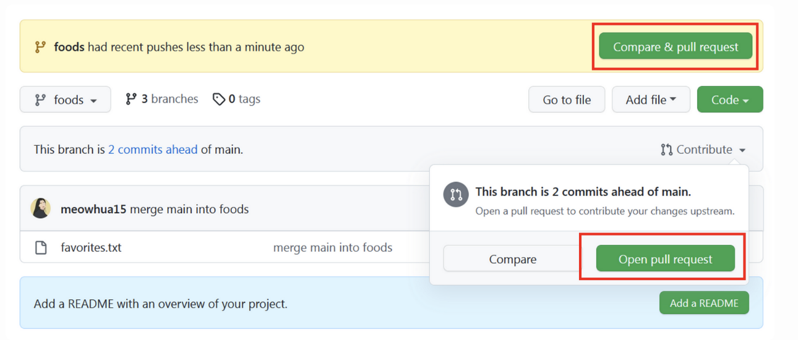
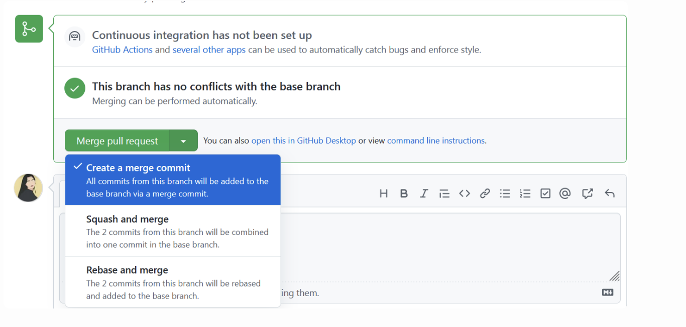
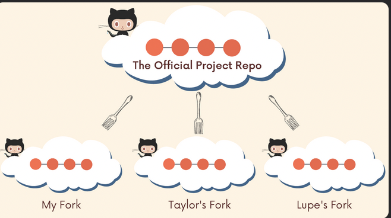
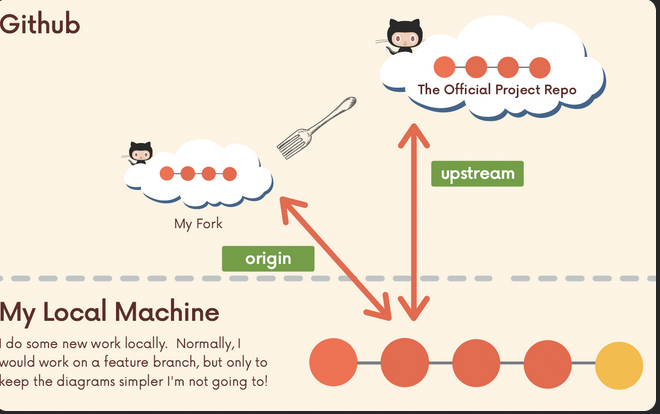
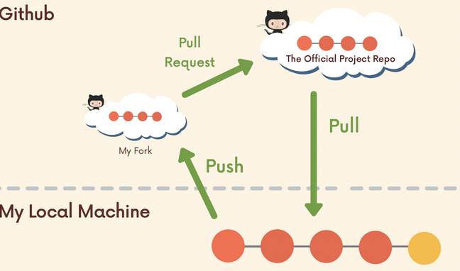

# Chap 14 | Git Collaboration Workflows

## Centralized Workflow

- Everyone works on master/main branch, the most basic workflow possible
- It's straightforward and can work for tiny teams, but it has quite a few shortcomings
- If your current work is behind the remote work, you cannot push instead of pulling (merge) by `git pull` first
- If you have some problematic code and want to share that with your collaborators and get some advise, you have to pull down the remote work, merge, then push your code.
   Since there's only one branch, this could be problematic!
- The problem
  - Lots of **time** spent **resolving conflicts and merging** code, especially as team size scales up
  - No one can work on anything without disturbing the main codebase. How do you try adding something **radically different** in? How do you **experiment**?
  - The only way to collaborate on a feature together with another teammate is to push **incomplete code** to master. Other teammates now have broken code…

## Feature Branches

- Rather than working directly on master/main, all new development should be done on **separate branches**
- Treat master/main branch as the official project history
- Multiple teammates can collaborate on a single feature and share code back and forth without polluting the master/main branch
  - Master/main branch won't contain broken code
- Specific teams and projects usually have their own branch naming conventions
  - Often you'll see branch names that include slashes like bug/fix-scroll or feature/login-form or feat/button/enable-pointer-events

## Merging Feature Branches

- At some point, the work on feature branches will need to be merged in to the master branch
- Option to merge to master branch
  - Merge at will, without any sort of discussion with teammates
  - Discuss with your team if the changes should be merged in
  - Pull Requests(Most Common)

## Pull Request 

Pull Requests are a feature built in to products like Github & Bitbucket. They are **not native to Git itself**

- They allow developers to **alert team-members to a new work** that needs to be reviewed
- They provide a mechanism to **approve or reject** the work on a given branch
- They also help facilitate **discussion and feedback** on the specified commits
- "I have this new stuff I want to merge in to the master branch…what do you all think about it?"

The workflow

- Do some work locally on a feature branch
- Push up the feature branch to Github
- Open a pull request using the feature branch just pushed up to Github 

- Wait for the pull request to be approved and merged .Start a discussion on the pull request .This part depends on the team structure

Pull request recap 

- Pull requests are a fancy way of requesting changes **from one branch be merged into another branch**

- Tools like Github & Bitbucket allow us to generate pull requests via an online interface. Team members can then view the changes and decide to merge them in or reject them.

- PR's also provide a place to discuss the changes and provide feedback

## Merging Pull Requests with Conflicts

- Just like any other merge, sometimes there are **conflicts** that need to be resolved when merging a pull request

- You can perform the merge and fix the conflicts on the **command line** like normal, or you can use **Github's interactive editor**

- To resolve the conflict locally:

  - Switch to the branch in question. Merge in master and resolve the conflicts

  ```bash
  git fetch origin 
  git switch my-new-feature 
  git merge master 
  # fix conflicts!
  ```

  - Switch to master. Merge in the feature branch (now with no conflicts). Push changes up to Github

  - ```bash
    git switch master 
    git merge my-new-feature
    git push origin master
    ```

- Configure the branch such that we cant merge into it 

## Fork & Clone Workflow 

- Instead of just one centralized Github repository, **every developer has their own Github repository** in addition to the **"main" repo**

- Developers make changes and push to **their own forks** before making pull requests

- It's very commonly used on large open-source projects where there may be thousands of contributors with only a couple maintainers

- Forking

  - Github (and similar tools) allow us to create personal copies of other peoples' repositories
  - We call those copies a **"fork"** of the original

  - When we fork a repo, we're basically asking Github "Make me my own copy of this repo on my Github please"
  - As with pull requests, forking is not a Git feature. The ability to fork is implemented by Github

- After forking?

  - I can clone my fork and make changes, add features, and break things without fear of disturbing the original repository

  - If I do want to share my work, I can make a **pull request** from my **fork** to the **original repo**

- The Fork and Clone Workflow

  - **Fork** the repo you want on Github
  - **Clone** the repo down to your local machine, the `origin` will be your own forked repo
  - Add a remote pointing to the **original repo**, i.e., `upstream` pointing to the original repo
    - Thus, if there are changes (commits, PR merges, …) made to the original repository, we can pull those changes down
    - `git remote add upstream <original-url>`

- Now, we have **two remotes**

- Make changes and add/commit on a feature branch on your local machine
- Push up new feature branch to `origin` (your forked repo)
- Open a **pull request** to the original project repo containing the new work on your forked repo

- Advantages of fork and clone workflow
  - allows a project maintainer to accept contributions from developers all around the world
  - without having to add them as actual owners of the main project repo
  - or, without worrying about giving them all permission to push to the repo