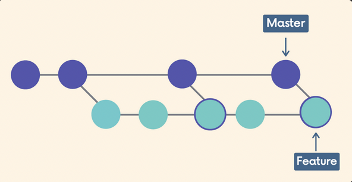
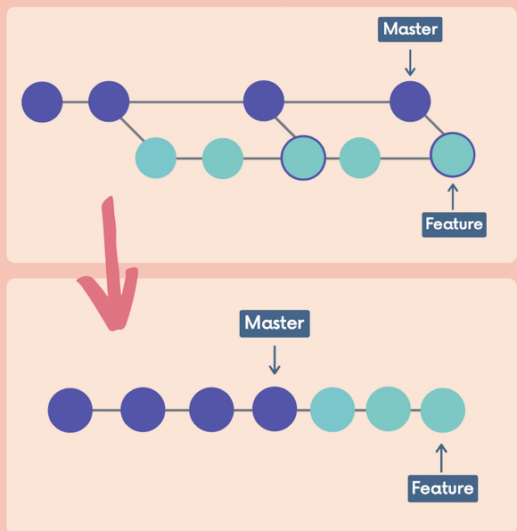

# Chap 15 | Rebasing 

There are two main ways to use the `git rebase` command 

-  as an alternative to merging ⬅️ Chap 15 
- as a cleanup tool ⬅️ Chap 16

## Comparing Merging & Rebasing 

- Why use rebase as an alternative to merging ? 
  - if the master branch is very active , my feature branch's history is muddied because of merge conflicts

- If we rebase the feature branch onto the master branch , we actually rewrite history and end up with a linear structure 
- This moves the entire feature branch so that it begins at the tip of the master branch 
  - i.e re-base-ing them at the tip of master

- Rebasing rewrites history by *creating new commits* for each of the original feature branches
- We can also wait until we are done with a feature and then rebase the feature branch onto the master branch