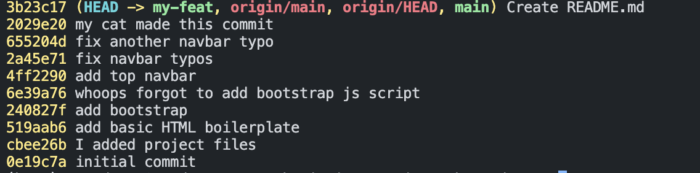
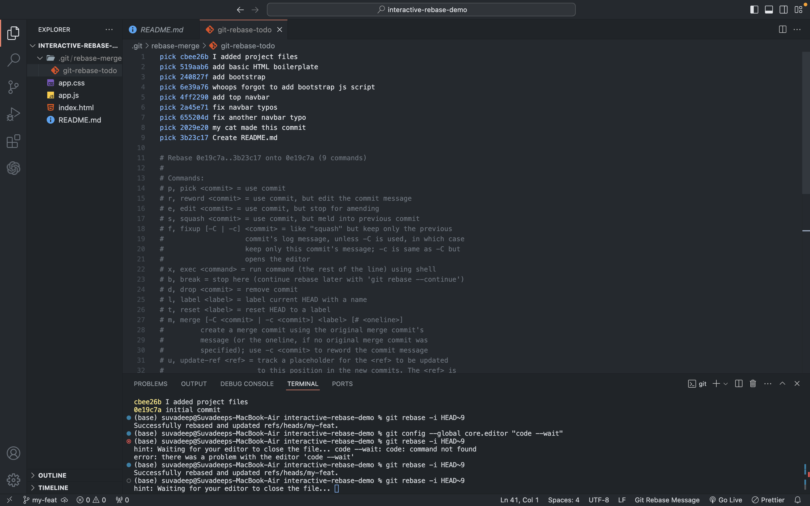
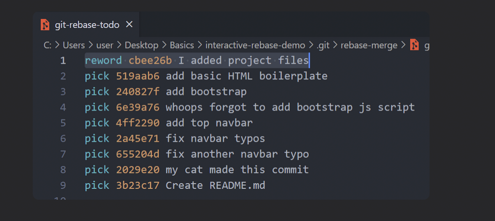
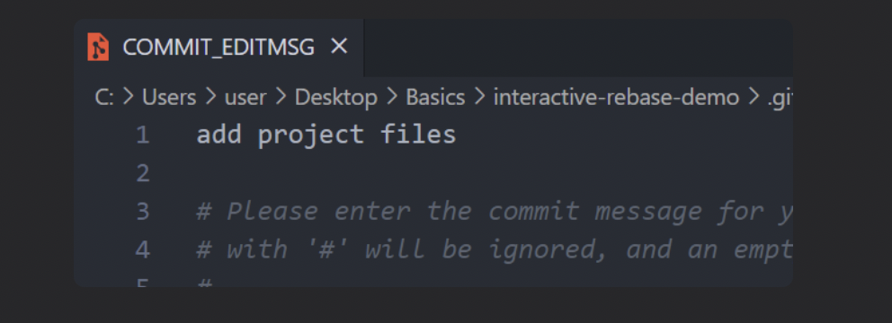
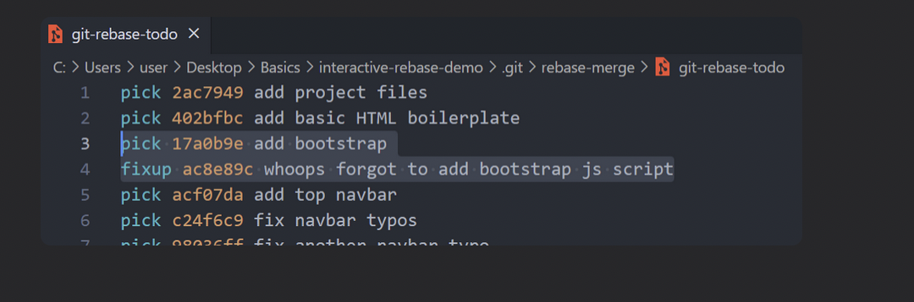
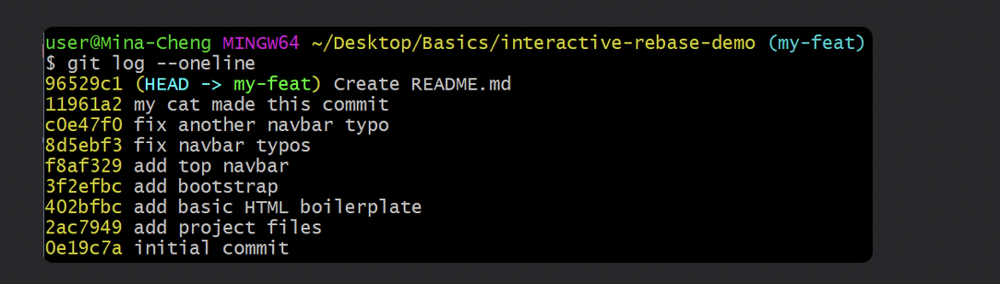
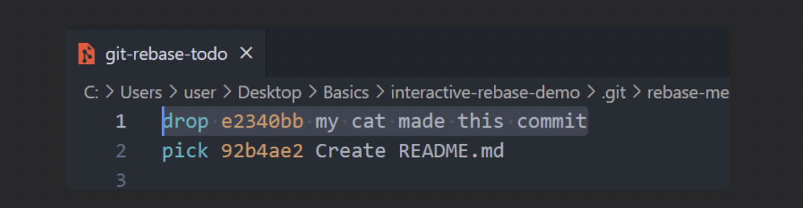
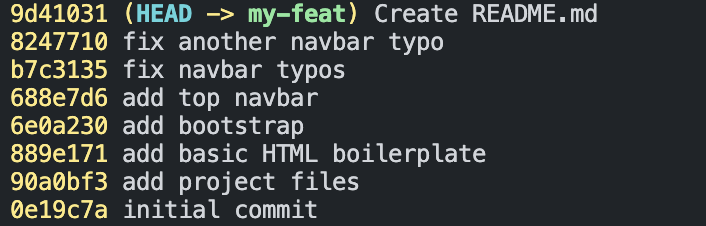

## Chap 16 |Cleaning Up History with Interactive Rebase

There are two main ways to use the `git rebase` command

- as an alternative to merging ← Chap 15
- as a cleanup tool **← Chap 16**

## Interactive Rebase Introduction

- We can use `git rebase` to rewrite history **before sharing them**

   - edit, rename, delete commits

   - change commit message

   - reorder commits

- Running `git rebase` with the `-i` option will enter the interactive mode, which allows us to edit commits, add files, drop commits, etc.

   - Note that we need to specify how far back we want to rewrite commits

   - We are not rebasing onto another branch

   - Instead, we are **rebasing a series of commits onto the HEAD they currently are based on**

   - For example, `git rebase -i HEAD~4`

- [Exercise](https://github.com/Colt/interactive-rebase-demo) to follow along

  - Create and switch to a new branch `my-feat` first , you don't want to rebase on master branch and mess it up 

  - If we use `git rebase -i HEAD~9`, it will lead us to a `git-rebase-todo` file, which shows us a list of **commands** on the commits (all the way to `HEAD~9`)

- In the `git-rebase-todo` file, we can use the commands to modify our commits
  - `pick` - use the commit
  - `reword` - use the commit, but edit the commit message
  - `edit` - use commit, but stop for amending
  - `fixup` - use commit contents but meld it into previous commit and discard the commit message
  - `drop` - remove commit

## Reword Commits

- Change the `git-rebase-todo` file's first line to `reword ....` and save

- Another file will open up, change the commit message and save

- Finished, note that **the commit hash changed**!

## Fixup and Squash Commits 

- Change the `git-rebase-todo` file's 4th line to `fixup ....` and save
  - This will **meld** that commit (whoops…) to its **previous** commit (add bootstrap) with only the previous commit's message being kept

- See our git log, we're done with different commit hash!

## Drop Commits

- Change the `git-rebase-todo` file's first line to `drop ....` and save

- Save and done!