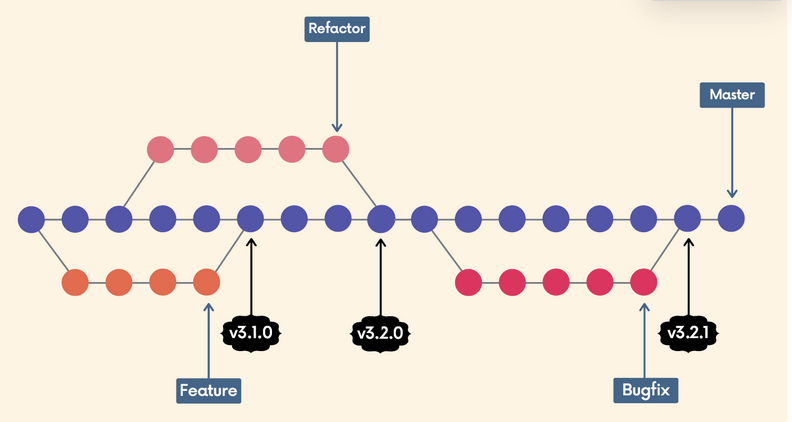
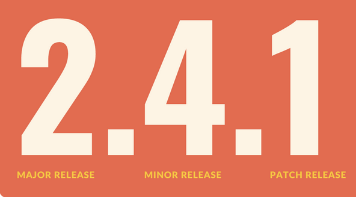

# Chap 17 | Git Tags : Marking Important Moment in History

## Idea Behind Git Tags

- Tags are **pointers** that refer to particular points in Git history. We can mark a particular moment in time with a tag
- Tags are most often used to **mark version releases** in projects (v4.1.0, v4.1.1, etc.)

- Think of tags as branch references that do NOT CHANGE.
  - Once a tag is created, it always refers to the same commit. It's just a **label for a commit**

- There are two types of Git tags we can use
  - **Lightweight tags**: just a name/label that points to a particular commit
  - **Annotated tags (preferred)**: store **extra meta data** including the author's name and email, the date, and a tagging message

## Semantic Versioning 

- The semantic versioning spec outlines a standardized versioning system for software releases
- It provides a consistent way for developers to give meaning to their software releases (how big of a change is this release?)
- Versions consist of **three numbers** separated by periods

- Initial Release: Typically, the initial release is v1.0.0
- **Patch Release** v1.0.1 v1.0.2
  - Normally do not contain new features or significant changes
  - typically signify bug fixes and other changes that **do not impact how the code is used**

- **Minor Release** v1.1.0
  - Signify that new features or functionality have been added
  - But the project is still **backwards compatible**
  - No breaking changes
  - The new functionality is optional and should not force users to rewrite their own code
- **Major Release** v2.0.0
  - Signify significant changes that is **no longer backwards compatible**
  - Features may be removed or changed substantially

## View and Search Tags

- `git tag` will print a list of all the tags in the current repository

- We can search for tags that match a particular pattern by using `git tag -l <regex>`

  - For example `git tag -l "*beta*"` will print a list of tags that include beta in their name

  

## Comparing Tags with Git Diff

1. To view the state of a repo at a particular tag, we can use `git checkout <tag>`
   - This puts us in detached HEAD!
2. Use `git diff v1.0.0 v2.0.0` to compare them for example

   