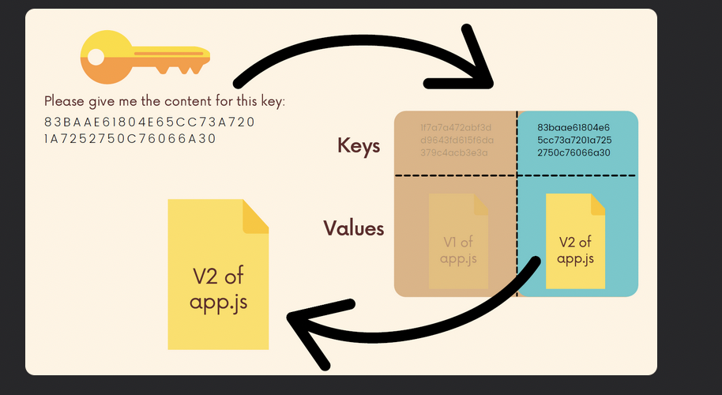
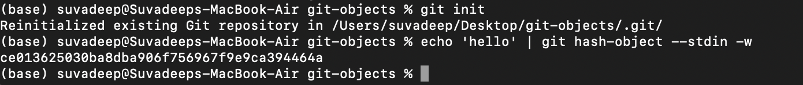

# Chap 18 | Hashing & Objects

What is in `.git` file?

- objects
- config
- HEAD
- refs
- …

## Local Config File

1. [git-config doc](https://git-scm.com/docs/git-config)

2. The `config` file is for configuration

3. We've seen how to configure global settings like our name and email across all Git repos

4. But we 

   can also configure things on a per-repo basis

   - `git config --local user.name <name>`
   - `git config --local user.email <email>`

5. We can do a lot many things, for example, change the bash/terminal text color

## Refs Folder

1. `Refs` stands for references, is where Git stores all of the **pointers** that points to certain commits (e.g, branch pointers, tags)
2. Inside of `refs`, you'll find a **heads directory**
3. `refs/heads` contains **one file per branch** in a repository. Each file is named after a branch and contains the hash of the commit at the tip of the branch
   - For example `refs/heads/master` contains the commit hash of the last commit on the `master` branch
4. `Refs` also contains a `refs/tags` folder which contains one file for each tag in the repo

## HEAD File

1. `HEAD` is just a text file that keeps track of **where HEAD points to**
2. If it contains `refs/heads/master`, this means that HEAD is pointing to the master branch
3. In detached HEAD, the `HEAD` file contains a commit hash instead of a branch reference

## Objects Folder

1. The objects directory contains **all the repo files**. This is where Git stores the **backups** of files, the commits in a repo, and more
   - The files are all compressed and encrypted into binary files
   - Git stores **full** snapshots, not just diffs
2. Four types of Git objects
   - commit
   - tree
   - blob
   - annotated tag

## Hashing Functions

1. [Hashing functions](https://emn178.github.io/online-tools/sha1.html) are functions that map input data of some arbitrary size to **fixed-size output values**
2. **Cryptographic hash functions**
   - A subset of hash functions
   - **One-way** function which is infeasible to invert
   - Small change in input yields large change in the output
   - Deterministic: same input yields same output
   - Unlikely to find 2 outputs with same value (avoid collision)
   - Applications: information security, digital signatures, cryptocurrency, and Git
3. SHA-1
   - Git uses a hashing function called SHA-1
   - SHA-1 always generates 40-digit hexadecimal numbers
   - The commit hashes we've seen a million times are the output of SHA-1

## Git As a Key-Value Datastore

Git is a key-value data store. We can insert any kind of content into a Git repository, and Git will hand us back a unique key we can later use to retrieve that content

- These keys that we get back are SHA-1 checksums

## Hashing with Git Hash-Object

- The `git hash-object` command takes some data, stores in in our `.git/objects` directory and gives us back the unique SHA-1 hash that refers to that data object

- In the simplest form `git hash-object <filename>`, Git simply takes some content and returns the unique key that WOULD be used to store our object. But it does not actually store anything

- ```bash
  echo 'hello' | git hash-object --stdin > ce013625030ba8dba906f756967f9e9ca394464a
  ```

  - The `--stdin` option tells `git hash-object` to use the content from stdin rather than a file. In our example, it will hash the word 'hello'

  - The `echo` command simply repeats whatever we tell it to repeat to the terminal. We pipe the output of echo to git hash-object

  - ```bash
    echo 'hello' | git hash-object --stdin -w > ce013625030ba8dba906f756967f9e9ca394464a
    ```

  - Rather than simply outputting the key that git would store our object under, we can use the `-w` option to tell git to actually **write the object to the database**
  - After running this command, check out the contents of `.git/objects`

  - The file contains our contents in binary, in this case is 'hello'

- For a **file**

  ```bash
  git hash-object dogs.txt -w > fd9150c2a3bb4081a41114065f42a1cd98d2124c
  ```

## Retrieving Data with Git Cat-File

1. Now that we have data stored in our Git object database, we can try retrieving it using the `git cat-file` command
2. `git cat-file -p <object-hash>`
   - The `-p` option tells Git to pretty print the contents of the object based on its type
3. `git cat-file -t <object-hash>` print the type of the object
4. For example

```bash
git cat-file -p ce013625030ba8dba906f756967f9e9ca394464a > hello 
# We don't need to provide the whole hash key
git cat-file -p fd9150c2a3 
> Rusty
> Wyatt
> Cheyenne
> Sirius
```

## Blobs

1. Git blobs (**binary large object**) are the **object type** Git uses to store **the contents of files** in a given repository
2. Blobs don't even include the filenames of each file or any other data. They just store the contents of a file!