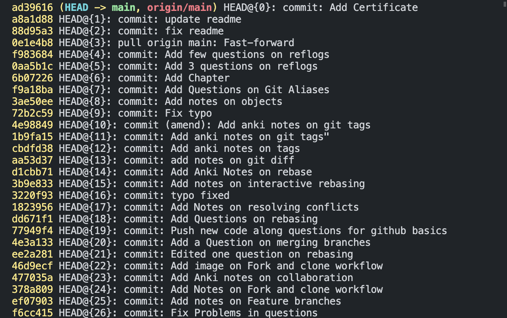
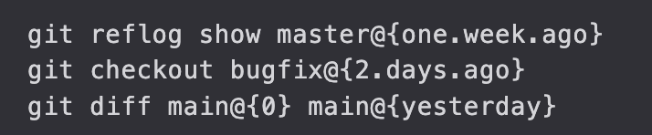
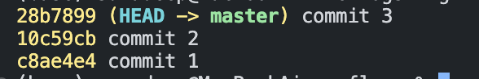
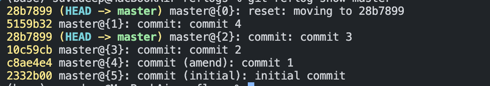
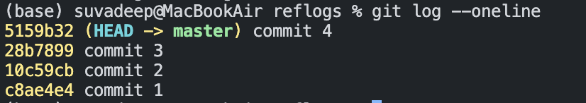

## Chap 19 | Reflogs : Retreieving "Lost" Work

#### Reflogs Introduction

- Short for "reference logs" there exist files in `.git/logs` that keep the record 
- Git keeps a record of when the tips of branches and other references were updated in the repo 
- We can view and update these reference logs using the `git reflog` command

#### The Limitation of Reflogs

- Git only keeps reflogs on your local activity 
  - They are not shared with collaborators 
- Reflogs also expire .Git cleans out old entries after around 90 days , though this can be configured

#### Git Reflog Show

- The `git reflog` command accepts subcommands `show`, `expire`, `delete`, and `exists`. `show` is the only commonly used variant, and it is the default subcommand.
- `git reflog show <reference>` will show the log of a specific reference (it defaults to HEAD)
  - git reflog show HEAD
  - `git reflog show main`: view the logs for the tip of the main branch
  - Note that we have those `<reference>{qualifier}` tags which indicate a particular entry in the reflog

#### Reflog References

- We can access specific git refs using `name@{qualifier}`. We can use this syntax to access specific ref pointers and can pass them to other commands including `checkout`, `reset`, and `merge`

#### Time-Based Reflog Qualifiers

- **Timed References**: every entry in the reference logs has a **timestamp** associated with it
- We can **filter** reflogs entries by time/date by using time qualifiers **like**
  - 1.day.ago
  - 3.minutes.ago
  - yesterday
  - Fri, 12 Feb 2021 14:06:21 -0800
- For example

#### Rescuing Lost Commits With Reflog 

- We can sometimes use reflog entries to access commits that seem lost and are not appearing in git log
- Assume that we accidentally delete a commit, and want it back `git reset --hard 28b7899`
- And we check out `git log`, we can see that the commit we delete is gone

- Use `git reflog show master`, and we can see that deleted commit and its hash

- Now, we can use `git reset --hard 5159b32` or `git reset --hard master@{1}` to get that commit back
  - We just undo a hard reset!

## Undoing a Rebase with Reflog

1. We can also undo rebase using the same technique