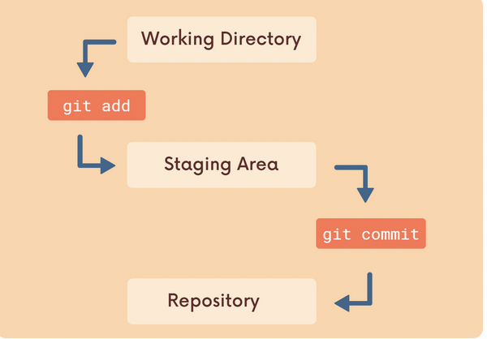

## Chap 4 | The Very Basics of Git : Adding & Committing 

**What is A Git Repo** ? 

- A Git Repo (Repository) is a workspace which tracks and manages files within a folder 
- A repo for a project / app /...
- We can have as many repos on our machine as needed , all with separate histories and contents 

**Git Init and Git Status**

- `git status` : gives information on the current status of a git repository and its contents 
- `git init`: creare a new git repository
  - Before we can do anything git-related , we must initialise a repo first
  - Do once per project , initialise the repo in the *top-level folder* containing your project 
  - Will create a hidden `.git` folder for us 

**Common Early Git Mistakes**:

- Git tracks a directory and all nested subdirectories
- Thus do not init a repo inside of a repo 
  - Before running git init , use git status first to verify that we are not currently inside a repo 
  - We can check all files with `ls -a` and if we are not careful we can delete `.git` folder with `rm -rf`

**Committing Workflow Overview**

**Staging Changes with Git add**:

- When we edit some files , save that and check git status ➡️ @ working directory 
- We use the git add to stage changes to be committed
  - add specific files to the staging area with `git add file1 file2`
  - `git add .` to stage all changes at once 

**Git Commit**

- We use git commit to actually commit changes from the staging area 
  - need to provide a commit message that summarizes the changes 
- The -m flag allows us to pass in an inline commit message 
  - `git commit -m "message"`
- Use `git commit -a -m "msg"`, to add all modified files and commit in shortcut way
- use `git log` to see the change log 

