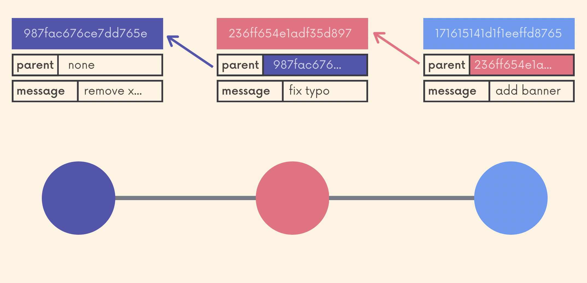

## Chap 6 | Working with branches 

### Branches Introduction

------

When we make a commit , each commit gets a hash (a unique identifier that corresponds to the commit) and each commit references at least one parent commit

t

Contexts: on large projects, we often work in multiple contexts

- You're working on 2 different color scheme variations for your website at the same time, unsure of which you like best
- You're also trying to fix a horrible bug, but it's proving tough to solve. You need to really hunt around and toggle some code on and off to figure it out
- A teammate is also working on adding a new chat widget to present at the next meeting. It's unclear if your company will end up using it
- …etc

If we all do these in a linear way, it would be impossible

- How could we be working on two separate things, where some of which break other people's code?

Branches

- **Alternative timelines** for a project
- They enable us to create separate contexts where we can try new things, or even work on multiple ideas **in parallel**
- If we make changes on one branch, they do not impact the other branches, unless we merge the **changes**

