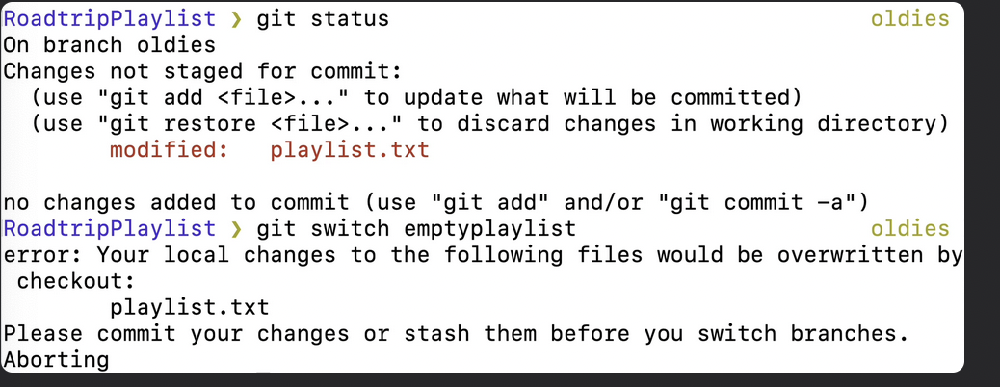

## Chap 6 | Working with branches 

## **Branches Introduction**

1. When we make a commit , each commit gets a hash (a unique identifier that corresponds to the commit) and each commit references at least one parent commit
2. Contexts: on large projects, we often work in multiple contexts
   - You're working on 2 different color scheme variations for your website at the same time, unsure of which you like best
   - You're also trying to fix a horrible bug, but it's proving tough to solve. You need to really hunt around and toggle some code on and off to figure it out
   - A teammate is also working on adding a new chat widget to present at the next meeting. It's unclear if your company will end up using it
   - …etc
3. If we all do these in a linear way, it would be impossible
   - How could we be working on two separate things, where some of which break other people's code?

4. Branches

   - Alternative timelines for a project

   - They enable us to create separate contexts where we can try new things, or even work on multiple ideas in parallel

   - If we make changes on one branch, they do not impact the other branches, unless we merge the changes

## **The Master Branch**:

The default branch name is **master**

- It is just the same as other branches

Many people designate the master branch as their "source of truth" or the "official branch" for their codebase, but that is left to you to decide

## **Head**:

- Each branch has a branch reference pointing to where we left called branch pointer . A branch pointer is where a branch currently is . Head is a reference to a branch pointer 
- HEAD is simply a **pointer** that refers to the **current "location"** in your repository. It points to a particular branch reference
- Like many different bookmarks in a book, only one position can be opened at a time

## **Git Branch Commands**:

1. Use `git branch` to **view** your existing branches
2. Look for the `*` which indicates the branch you are **currently on**
3. To exit out of the window showing all the branches press q (if it takes full screen)
4. Use `git branch <branch-name>` to **make a new branch** based upon the **current HEAD**
   - This just creates the branch, it does not switch you to that branch (the HEAD stays the same)
5. Once you have created a new branch, use `git switch <branch-name>` to switch to it
6. Another way of switch: `git checkout <branch-name>`, but this command does a million additional things
7. Create and switch to a branch **at the same time**: `git switch -c <branch-name>` or `git checkout -b <branch-name>`
   - `-c` stands for create
   - `-b` stands for branch

## **Switching Branches with Unstaged Changes ?**

If you switch branches with unstaged changes we will get an error if the unstaged changes are not a new file 

Two options:

- commit it 
- stash it 

We will not get an error if the unstaged changes are  in a new file and the new file will be moved to the new branch  

## **Deleting & Renaming Branches**:

Use `git branch -d <branch-name>`

- You cannot be in that branch if you want to delete it
- You cannot delete a branch thats not fully merged , we can confirm we want to delete it with the D flag i,e `git branch -D <branch-name>`

Use `git branch -m <new-branch-name>` to rename a branch, when **you are in the branch** you want to rename