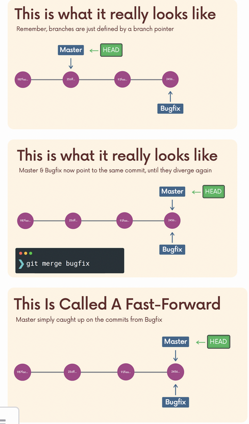

## Chap 7 | Merging Branches 

## Introduction to Merge 

- Two basic concepts 
  - We merge branches , not specific commits 
  - We always merge to the current HEAD branch 
- Two basic steps
  - Switch to or checkout the branch you want to merge the changes into(the receiving branch)
  - Use `git merge` to merge changes from a specific branch into the current branch 

## Fast-Forward Merge 

- A fast-forward merge can occur when there is a linear path from the current branch tip to the target branch 
- Instead of actually merging the branches , all Git has to do to integrate the histories is move (i.e "fast forward") the current branch tip up to the target branch tip 

```bash
# For example, merge the bugfix branch into master

git switch master
git merge bugfix
```

Visualization 


Actually it looks like this , this is called a fast-forward



## Not All Merges Are Fast-Forwards!

- Imagine one of your teammates merged in a new feature or change to master while you were working on a branch 
- 

- Two scenarios 
  - There is no conflict  ➡️ git can do the merge for us automatically 
  - There is a conflict , eg your teammates edit line 45 on master and you also edit line 45 on bugfix, which edit will win ? 

- The no conflict scenario

  - Rather than performing a simple fast forward , git performs a "merge commit"
  - We end up with a new commit on the master branch
  - Git will prompt you for a message
  - 

  - That merge commit will have two parent commits 
  - 
