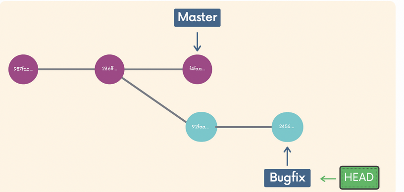

# Chap 7 | Merging Branches 

## Introduction to Merge 

- Two basic concepts 
  - We merge branches , not specific commits 
  - We always merge to the current HEAD branch 
- Two basic steps
  - Switch to or checkout the branch you want to merge the changes into(the receiving branch)
  - Use `git merge` to merge changes from a specific branch into the current branch 

## Fast-Forward Merge 

- A fast-forward merge can occur when there is a linear path from the current branch tip to the target branch 
- Instead of actually merging the branches , all Git has to do to integrate the histories is move (i.e "fast forward") the current branch tip up to the target branch tip 

```bash
# For example, merge the bugfix branch into master

git switch master
git merge bugfix
```

Visualization 


Actually it looks like this , this is called a fast-forward


## Not All Merges Are Fast-Forwards!

- Imagine one of your teammates merged in a new feature or change to master while you were working on a branch 
- 

- Two scenarios 
  - There is no conflict  ➡️ git can do the merge for us automatically 
  - There is a conflict , eg your teammates edit line 45 on master and you also edit line 45 on bugfix, which edit will win ? 

- The no conflict scenario

  - Rather than performing a simple fast forward , git performs a "merge commit"
  - We end up with a new commit on the master branch
  - Git will prompt you for a message
  - 

  - That merge commit will have two parent commits 
  - 

## Merge Conflicts

- Depending on the specific changes you are trying to merge , Git may not be able to automatically merge 
  - This results in merge conflicts, whivh we need to manually resolve 
- When you encounter a merge conflict ,Git warns you in the console that it could not automatically merge  

- It also changes the contents of our files to indicate the conflicts that it wants you to resolve
  - The content from your current HEAD (the branch you are trying to merge content into) is displayed between the <<<<<<< HEAD and =======
  - The content from the branch you are trying to merge from is displayed between the ======= and >>>>>>> symbols.

- Resolving conflicts 
  - Open up the file(s) with merge conflicts
  - Edit the file(s) to remove the conflicts.Decide which branch's content you want to keep in each conflict.Or keep the content from both 
  - Remove the conflict "markers" in the document
  - Add your changes and then make a commit! 
