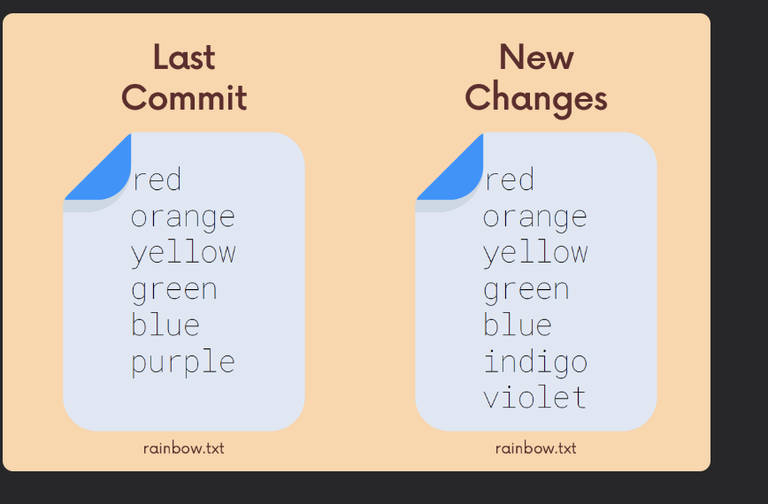

## Chap 8 | Comparing changes with git diff

## Introduction to Git Diff

1. We can use *git diff* to view changes between commits , branches , files our working directory and more
2. We often use *git diff* alongside commands like *git status* and *git log* to get a better picture of a repository and how it has changed over time 

## Reading Diffs



If we use `git diff` we'll get the output as below

```bash
diff --git a/rainbow.txt b/rainbow.txt index 

72d1d5a..f2c8117 100644 

--- a/rainbow.txt 

+++ b/rainbow.txt 

@@ -3,4 +3,5 @@ 

orange 

yellow 

green 

blue 

-purple 

+indigo 

+violet
```

**Line 1**: Which files are being compared, usually is the two versions of the same file. One is declared as "A", and the other as "B"

**Line 2**: File metadata

**Line 3-4**: Markers, file A and B are each assigned a symbol

- File A gets a minus sign (-)
- File B gets a plus sign (+)

**Line 5-11**: Chuncks, shows portions or "chunks" that were modified, also includes some unchanged lines before and after a change to provide some context

- Chunk header: `@@ -3,4 +3,5 @@`
  - From file A, 4 lines are extracted starting from line 3
  - From file B, 5 lines are extracted starting from line 3
- Changes: Every line that changed between the two files is marked with either a + or - symbol
  - Lines that begin with - come from file A
  - Lines that begin with + come from file B