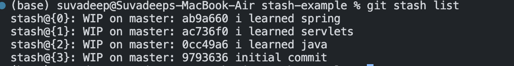

# Chap 9 | The Ins and Outs of Stashing 

## Introduction to Stash 

Imagine when you switch to other branches with uncommitted files on current branch , what will happen ? 

- My changes come with me to the destination branch (no potiential conflicts)
- Git wont let me switch if it detects potiential conflicts 

Stashing ➡️➡️ Git provides an easy way of stashing these uncommitted changes so that we can return to them later , without having to make unnecessary commits

## Git Stash save / pop 

- `git stash` or `git stash save`  help you save changes that we are not yet ready to commit .We can stash changes and then come back to them later 
- Running git stash will take all uncommitted changes (staged and unstaged) and stash them in our working directory 
- git stash pop removes the most recently stashed changes in your stash and re-apply them in your working directory 

## Git Stash Apply 

- We can use *git stash apply* to apply whatever is stashed away without removing it from the stash
- This can be useful if we want to apply stashed changes to multiple branches 

## Multiple Stashes

- We can add multiple stashes onto the stack of stashes .They will all be stashed away in the order we added them 
- Viewing stashes : `git stash list`

Note ➡️  ➡️ WIP(work in progress) on branch : most-recent-commit-hash most recent commit message

## Applying Specific Stashes: 

- git assumes we want to apply the most recent stash when we run `git stash apply` but we can also specify a particular stash like `git stash apply stash@{2}`

## Dropping and Clearing the stash 

- To delete a particular stash use the following command `git stash drop <stash@id>`

Example ➡️ git stash drop stash@{2}

- To clear out all stashes, run `git stash clear`